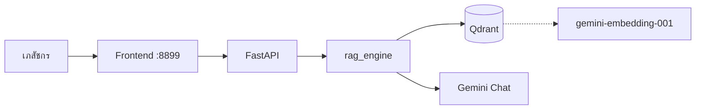
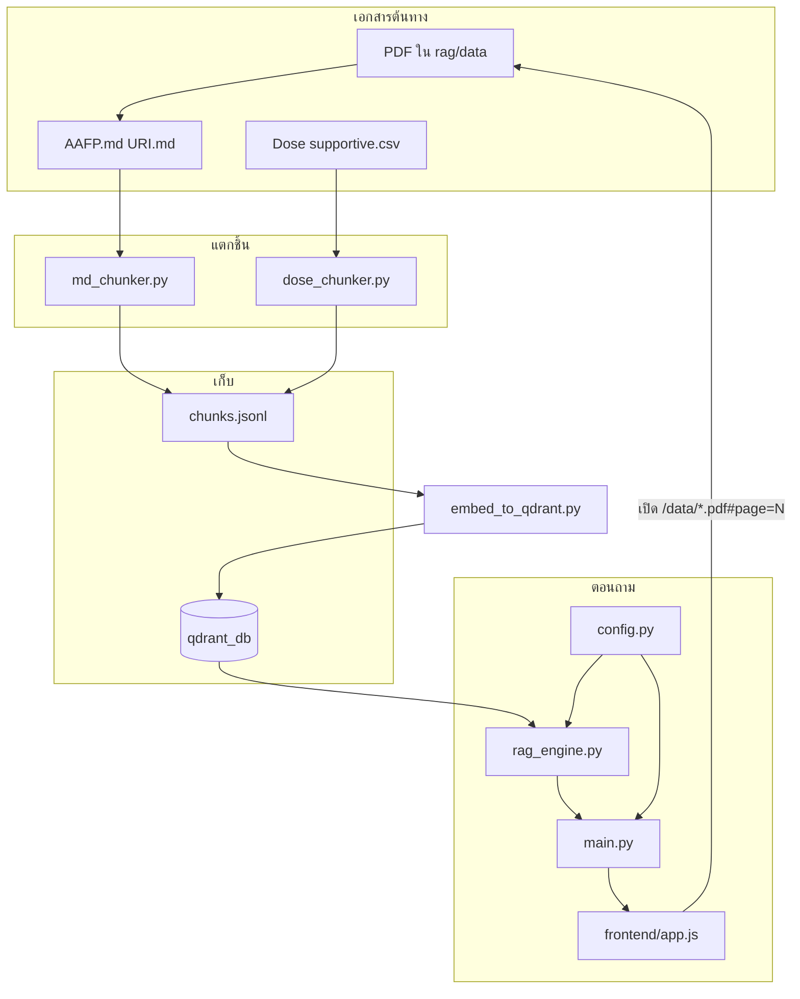
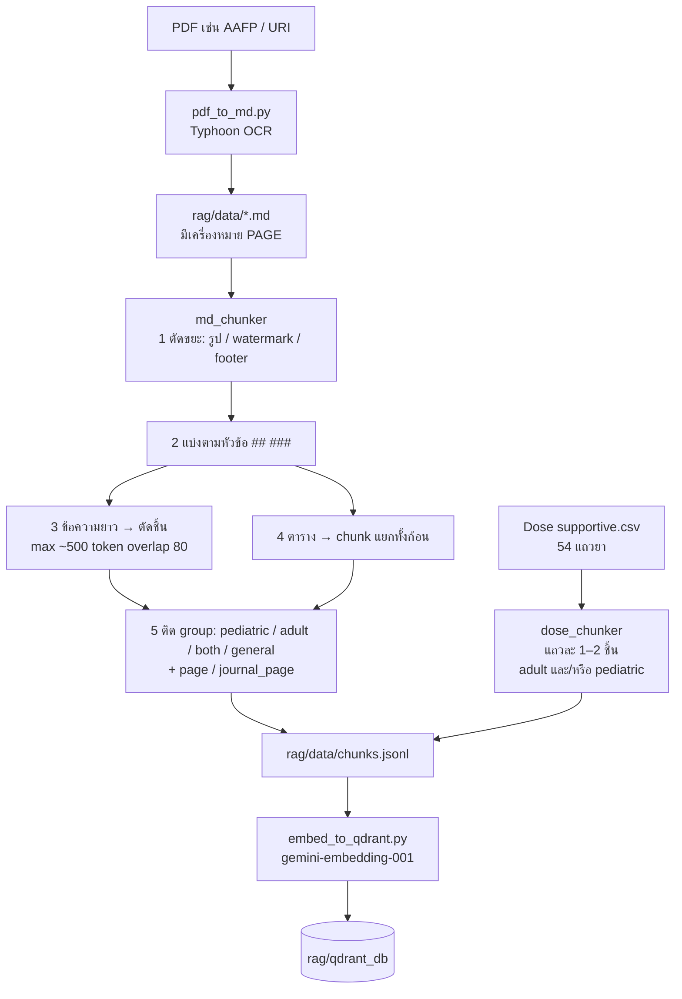
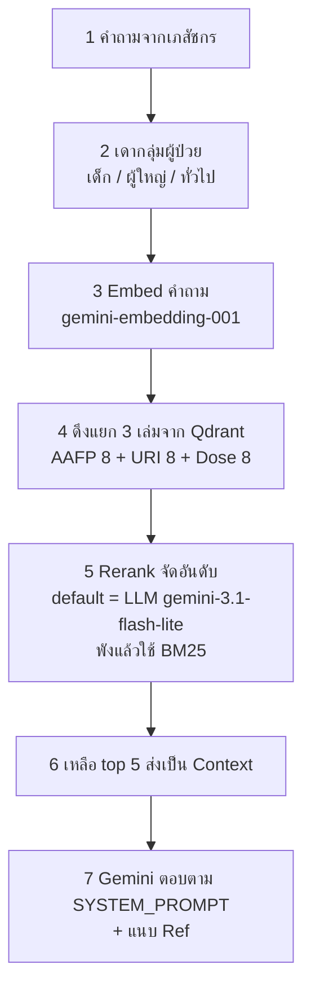

# Handoff — Uncle_Jack

เอกสารส่งต่อ PharmaCare AI (อัปเดต 13 Jul 2026)  
เป้าหมายรอบถัดไปที่รับไม้: **optimize prompt / คุณภาพคำตอบ** (ชั้น retrieve พอใช้ได้แล้ว)

---

## 1) Overview — โปรเจคนี้คืออะไร

**PharmaCare AI** = chatbot สำหรับเภสัชกร ตอบคำถาม URI / ยาปฏิชีวนะ / ขนาดยา โดยอ้างอิงเอกสารจริงผ่าน RAG

| แหล่ง | เนื้อหา |
|--------|---------|
| **AAFP 2022** | แนวทางใช้ยาปฏิชีวนะใน Upper Respiratory Tract Infections |
| **URI เด็ก 2562** | แนวทางเวชปฏิบัติไทย (เด็ก) |
| **Dose supportive** | ตารางขนาดยา / ข้อห้าม (จาก CSV → เปิด PDF ตามเลขหน้าได้) |

Stack สั้นๆ: **FastAPI + Qdrant + Gemini (embed + chat + LLM rerank) + Frontend HTML/JS**  
รันผ่าน Docker → เปิดที่ **http://localhost:8899**



---

## 2) โครงสร้างไฟล์ + ความสัมพันธ์

```
d:/Fast/
├── backend/                    # โค้ดเซิร์ฟเวอร์ + RAG
│   ├── config.py               # ★ path + โมเดล + knobs จุดเดียว
│   ├── main.py                 # FastAPI routes / mount static
│   ├── rag_engine.py           # retrieve → rerank → ตอบ (+ SYSTEM_PROMPT)
│   ├── md_chunker.py           # Strategy C: AAFP.md / URI.md → chunks
│   ├── dose_chunker.py         # Dose CSV → chunks (adult/pediatric)
│   ├── embed_to_qdrant.py      # embed chunks → rag/qdrant_db
│   ├── patient_group.py        # ติด/กรอง pediatric|adult|…
│   ├── auth.py                 # login JWT
│   ├── session_manager.py      # chat history (SQLite)
│   ├── semantic_memory.py      # ความจำระยะยาวใน Qdrant
│   └── patient_summary.py      # สรุปผู้ป่วย (+ SUMMARY_PROMPT)
│
├── rag/                        # ★ โซนความรู้ + pipeline
│   ├── data/                   # เอกสารต้นทาง + runtime data
│   │   ├── AAFP.md / URI.md
│   │   ├── Dose supportive.csv (+ .pdf)
│   │   ├── AAFP_2022_Original.pdf / P2_URI.pdf
│   │   ├── chunks.jsonl        # ผล chunk ทั้งก้อน (229 บรรทัด)
│   │   ├── users.json / chat_history.db / test_case.csv
│   ├── qdrant_db/              # Vector DB production
│   ├── pipeline.py            # คำสั่ง chunk + embed
│   └── embed_log.txt
│
├── frontend/                   # UI (mount แล้ว — แก้แล้ว refresh พอ)
│   ├── index.html / login.html / …
│   ├── js/app.js               # chat, เปิด PDF #page=N
│   └── css/styles.css
│
├── experiments/chunking/       # notebook วัด retrieve (ไม่ใช่ production)
├── readme/                     # README, plan_2, STRATEGY_C, CHANGELOG
├── docker-compose.yml
├── Dockerfile
├── .env                        # GOOGLE_API_KEY, JWT_SECRET
├── pipeline.py                 # shim → rag/pipeline.py
└── HANDOFF_Uncle_Jack.md       # ไฟล์นี้
```

### ความสัมพันธ์หลัก



**กติกา:** path ใหม่ห้าม hardcode — import จาก `backend/config.py` เท่านั้น

---

## 3) วิธีรันแอป

### Docker (แนะนำ)

```bash
docker compose up --build
```

แล้วเปิด **http://localhost:8899**

| ตรงไหน | พอร์ต | ความหมาย |
|--------|-------|----------|
| Browser ของคุณ | **8899** | เข้าแอปที่นี่ |
| ใน container (uvicorn) | **8000** | ฟังพอร์ตภายใน |
| `docker-compose.yml` | `8899:8000` | แมป host → container |

Log ที่เห็น `Uvicorn running on http://0.0.0.0:8000` = **ปกติ**  
อย่าเปิด `:8000` บน host — ใช้ **`:8899`**

Compose mount (แก้แล้วเห็นทันที / ไม่ต้อง `--build` ทุกครั้ง):

| Host | Container |
|------|-----------|
| `./backend` | `/app/backend` |
| `./frontend` | `/app/frontend` |
| `./rag/data` | `/app/rag/data` |
| `./rag/qdrant_db` | `/app/rag/qdrant_db` |
| `./.env` | `/app/.env` |

ต้อง `--build` เมื่อ: เปลี่ยน `Dockerfile` / `requirements.txt`  
แก้ `backend/` หรือ `frontend/` → **restart หรือ refresh พอ**

### รัน local โดยไม่ Docker

```bash
uvicorn backend.main:app --reload --host 0.0.0.0 --port 8000
# แล้วเปิด http://localhost:8000
```

ต้องมี `.env` + `GOOGLE_API_KEY`

---

## 4) เบื้องหลังระบบ

### 4.1) Chunk — จากเอกสารถึง Qdrant

#### ตารางไฟล์ที่เกี่ยวกับ chunk

| ไฟล์ | ทำอะไร | ใช้ตอนไหน |
|------|--------|-----------|
| `backend/pdf_to_md.py` | PDF → Markdown (Typhoon OCR) + ใส่ `<!-- PAGE N -->` | มี PDF ใหม่ / อยาก OCR ใหม่ |
| `backend/md_chunker.py` | แตก `.md` (AAFP / URI) แบบ Strategy C | รัน pipeline |
| `backend/dose_chunker.py` | อ่าน **Dose CSV** → ทำ chunk ยา (ไม่ผ่าน OCR/Strategy C) | รัน pipeline |
| `backend/patient_group.py` | ติดป้ายเด็ก/ผู้ใหญ่/ทั่วไป ให้ chunk | ถูกเรียกจาก md_chunker |
| `backend/embed_to_qdrant.py` | อ่าน `chunks.jsonl` → embed → เก็บ Qdrant | รัน pipeline |
| `rag/pipeline.py` | คุมลำดับ: chunk ทุกแหล่ง → รวม jsonl → embed | คำสั่งที่คุณรัน |
| `rag/data/AAFP.md`, `URI.md` | เอกสารหลัง OCR | อินพุตของ md_chunker |
| `rag/data/Dose supportive.csv` | ตารางยา | อินพุตของ dose_chunker |
| `rag/data/chunks.jsonl` | **ผลลัพธ์รวม** 1 บรรทัด = 1 chunk (เปิดดูได้) | ก่อน embed / debug |
| `rag/qdrant_db/` | Vector DB ที่แอปค้นตอนถาม | production |
| `backend/config.py` | ชี้ path + รายการ MD_FILES / Dose CSV | ทุกขั้น |

**สรุป Dose:** ไม่ได้ OCR ไม่ได้ Strategy C — อ่านแถว CSV ตรงๆ แล้วเขียนเข้า `chunks.jsonl` รวมกับ AAFP/URI  
เปิดดูตัวอย่างได้ที่ `rag/data/chunks.jsonl` (ค้น `dose_` หรือ `"source": "Dose"`)

จำนวนตอนนี้: **229** = AAFP 38 + URI 94 + Dose 97

#### ภาพรวม flow (mermaid)



#### ตัวอย่างสั้นๆ ว่า “แตกยังไง”

**A) AAFP / URI (จาก .md)**

```text
ในไฟล์ .md มีหัวข้อ + ย่อหน้ายาว + ตาราง
        │
        ├─ ตัดลายน้ำ / รูปออก
        ├─ อยู่ใต้หัวข้อเดียวกัน → รวมเป็นก้อน
        ├─ ยาวเกิน → หั่นเป็นหลายชิ้น (ทับกัน overlap 80)
        ├─ เจอ <table> → เก็บเป็น chunk ตารางคนละชิ้น
        └─ แปะป้าย เช่น patient_group=pediatric, page=20
```

ตัวอย่างใน `chunks.jsonl` (ย่อ):

```text
[Source: AAFP | Page: 2 | Section: ... > Table]
[Context: ...]
<table>...</table>
```

**B) Dose (จาก CSV — คนละวิธี)**

```text
1 แถวยา Paracetamol
  ├─ มีช่อง Dose ผู้ใหญ่ → 1 chunk (group=adult, page=13)
  └─ มีช่อง Dose เด็ก    → 1 chunk (group=pediatric, page=13)
→ เลยได้ ~97 ชิ้น จาก 54 แถว (ไม่ใช่ 54 ชิ้น)
```

ตัวอย่างใน `chunks.jsonl` (ย่อ):

```text
[Source: Dose | Page: 13 | Drug: Paracetamol | Group: adult]
Drug: Paracetamol
Dose (ผู้ใหญ่): ...
Ref: Dose, หน้า 13 (Dose supportive.pdf)
```

#### ถ้าจะ embedding / อินเด็กซ์ใหม่

หยุดแอปก่อน (กัน DB ล็อก) แล้วจากโฟลเดอร์โปรเจกต์:

```bash
docker compose down

python rag/pipeline.py --reset
# = ลบ chunks.jsonl + qdrant_db → chunk ใหม่ทั้ง AAFP/URI/Dose → embed ใหม่

docker compose up --build
```

หรือทีละขั้น:

```bash
python rag/pipeline.py --chunk-only   # สร้าง chunks.jsonl อย่างเดียว (เปิดดูได้)
python rag/pipeline.py --embed-only   # เอา jsonl ไป embed อย่างเดียว
```

มี PDF ใหม่ทั้งเล่ม → OCR ด้วย `pdf_to_md.py` ให้ได้ `.md` ก่อน แล้วค่อย `--reset`

รายละเอียด Strategy C เพิ่ม: `readme/STRATEGY_C_explained.md`

---

### 4.2) RAG ตอนมีคนถาม (สั้นๆ)



ภาษาคน: **ถาม → หาชิ้นจาก 3 เอกสาร → จัดอันดับใหม่ → เหลือ 5 ชิ้น → ให้โมเดลตอบ**

#### โมเดล + knob

| ใช้ทำ | ค่า | อยู่ที่ |
|-------|-----|--------|
| Embed | `models/gemini-embedding-001` | `config.py` → `EMBED_MODEL` |
| ตอบแชท | `models/gemini-3.1-flash-lite` | `CHAT_MODEL` |
| Rerank (default) | ตัวเดียวกับแชท | `RERANK_MODE=llm` |
| ดึงต่อเล่ม | `8` | `PER_SOURCE_TOP_K` |
| ส่งเข้าตอบ | `5` | `TOP_K` |
| สลับ rerank | `llm` / `bm25` / `vector` | env `RERANK_MODE` |

โค้ดหลัก: `backend/rag_engine.py` (prompt อยู่ไฟล์นี้)

---

### 4.3) Backend ทำอะไรบ้าง

| ไฟล์ | หน้าที่ |
|------|---------|
| `main.py` | API: auth, chat stream, sessions, patients, testcases; mount `/static`, `/data` |
| `rag_engine.py` | หัวใจ RAG + **SYSTEM_PROMPT** / user template / rerank prompt |
| `config.py` | path + โมเดล + knobs |
| `md_chunker.py` / `dose_chunker.py` | สร้าง chunks |
| `embed_to_qdrant.py` | เขียนเวกเตอร์ |
| `patient_group.py` | เดา/กรองกลุ่มผู้ป่วย |
| `auth.py` | login + JWT (`users.json`) |
| `session_manager.py` | บันทึกแชท SQLite |
| `semantic_memory.py` | ความจำข้าม session ใน Qdrant (`chat_memory`) |
| `patient_summary.py` | สรุปผู้ป่วย + **SUMMARY_PROMPT** |
| `pdf_to_md.py` | OCR PDF → MD (ไม่รันทุกครั้ง) |

---

### 4.4) หน้าบ้าน + รหัสเข้าใช้

| หน้า | ไฟล์ | ทำอะไร |
|------|------|--------|
| แชทหลัก | `frontend/index.html` + `js/app.js` | ส่งคำถาม, stream คำตอบ, แสดง Ref, เปิด PDF |
| Login | `login.html` | เข้าสู่ระบบ |
| ผู้ป่วย | `patients.html` / `patient.html` | รายชื่อ + สรุป |
| เทสเคส | `testcase.html` | รันเคสจาก CSV |

เปิด PDF: `/data/ชื่อไฟล์.pdf#page=N` (อย่าต่อ `&search=` ท้าย hash)

#### บัญชีในระบบ (`rag/data/users.json`)

| Username | Password | บทบาท |
|----------|----------|--------|
| `admin` | `123` | ผู้ดูแล (default จาก `auth.py`) |
| `pharmacist1` | *(รหัสที่ตั้งตอนสร้าง user)* | เภสัชกร |
| `pharmacist2` | *(รหัสที่ตั้งตอนสร้าง user)* | เภสัชกร |
| `pharmacist3` | *(รหัสที่ตั้งตอนสร้าง user)* | เภสัชกร |
| `pharmacist4` | *(รหัสที่ตั้งตอนสร้าง user)* | เภสัชกร |
| `pharmacist5` | *(รหัสที่ตั้งตอนสร้าง user)* | เภสัชกร |

> รหัส pharmacist เก็บแบบ hash ใน `users.json` — ใส่รหัสจริงตรงตารางนี้ก่อนส่งให้ Uncle_Jack  
> รีเซ็ต/เพิ่ม user: ดูฟังก์ชัน `add_user` ใน `backend/auth.py`

---

## 5) ปัญหาเดิม 9 ข้อ — แก้ไปถึงไหน

| # | ปัญหา | สถานะ | หมายเหตุ |
|---|--------|--------|----------|
| 1 | อ้างผิดกลุ่มผู้ป่วย (เด็ก↔ผู้ใหญ่) | ✅ บางส่วน | `patient_group` + filter |
| 2 | เลขหน้า / เนื้อหาไม่ตรง | ✅ บางส่วน | parser + `journal_page`; UI ใช้ `page` เปิด PDF |
| 3 | Ref ภายนอกไม่มี URL | ❌ | **งาน prompt** |
| 4 | ผสม Guideline + ความรู้ทั่วไป | ❌ | **งาน prompt** |
| 5 | Dose เด็กไม่มี Min–Max | ✅ ชั้น data | Dose อยู่ใน RAG แล้ว; ยังไม่มี mL calc |
| 6 | คำนวณ mL จากความแรงยา | 🔮 อนาคต | ยังไม่ทำ |
| 7 | ไม่เทียบ URI + AAFP | ✅ บางส่วน | ดึงสองเล่มแล้ว — ยังไม่บังคับ LLM เทียบในคำตอบ |
| 8 | ดึงผิดหัวข้อ / ผิดเล่ม | ✅ | Strategy C + per-source + LLM rerank |
| 9 | เด็ก &lt;4 ปี ยาแก้ไอ | ✅ บางส่วน | retrieve ดีขึ้น; ยังไม่มี safety gate |

รายละเอียดยาว: `readme/plan_2.md`  
ตัวเลข retrieve Run 3 (25 cases): Source **1.00** | MRR **0.695** | Page journal **0.64**

---

## สำหรับ Uncle_Jack — optimize prompt แก้ไฟล์ไหน

### จุดแก้หลัก (เริ่มที่นี่)

ไฟล์: **[`backend/rag_engine.py`](backend/rag_engine.py)**

| ตัวแปร / ช่วง | บรรทัดโดยประมาณ | ใช้ทำอะไร |
|---------------|-----------------|-----------|
| `SYSTEM_PROMPT` | ~35–89 | บทบาท, ประเภทคำถาม 1–4, กฎ Ref, รูปแบบคำตอบ |
| `USER_MESSAGE_TEMPLATE` | ~93–103 | ห่อคำถาม + context ตอนเรียกแชท |
| prompt ใน `_llm_rerank` | ~350–370 | สั่ง Gemini จัดอันดับ candidate (JSON `ranked_ids`) |
| prompt ใน `evaluate_answer_llm` | ~810+ | เกรดคำตอบ (ถ้าใช้) |
| prompt ใน `summarize_history` | ~857+ | สรุปประวัติแชทยาว |

ไฟล์รอง:

| ไฟล์ | ตัวแปร | ใช้เมื่อ |
|------|--------|----------|
| `backend/patient_summary.py` | `SUMMARY_PROMPT` | สรุปผู้ป่วยในหน้า patients |

### สิ่งที่ควรโฟกัสถ้าทำ prompt (ข้อ 3, 4, 7)

1. **บังคับรูปแบบ Ref** ให้มี URL เมื่อเป็นความรู้ภายนอก (ข้อ 3)
2. **แยกชัด** “จาก Context guideline” vs “ความรู้ทั่วไป” — อย่าปนโดยไม่บอก (ข้อ 4)
3. **เมื่อมีทั้ง URI + AAFP ใน context** ให้เทียบ/ระบุความต่างระยะรักษา ฯลฯ (ข้อ 7)
4. **Dose:** ย้ำว่าขนาดยาต้องมาจาก Context เท่านั้น — ห้ามแต่ง

หลังแก้ `SYSTEM_PROMPT`: เพราะ `backend/` mount แล้ว → `docker compose restart` หรือรอ reload แล้วถามใหม่  
**ไม่ต้อง** `pipeline.py --reset` (prompt ไม่เกี่ยวกับ embedding)

---

## ข้อระวัง (อ่านก่อนพัง)

1. **พอร์ต:** ใช้ **8899** ในเบราว์เซอร์ — log uvicorn ขึ้น 8000 ได้ ไม่ใช่บัค  
2. **Qdrant lock:** อย่ารัน `rag/pipeline.py` บน host พร้อมกับ container ที่เปิด DB อยู่  
3. **อย่า hardcode path** — ใช้ `backend/config.py`  
4. **แก้ backend แล้วอย่าลืม:** mount แล้ว restart พอ; เปลี่ยน deps ถึงต้อง `--build`  
5. **Dose PDF:** วางที่ `rag/data/Dose supportive.pdf` ไม่งั้นเปิด Ref Dose จะ 404  
6. **เลขหน้า AAFP:** `page` = หน้าไฟล์ PDF ที่เปิดใน UI; `journal_page` = เลขวารสาร (ใช้ eval) — คนละค่า  
7. **experiments/** ไม่ใช่ production — อย่าสับสนกับ `rag/qdrant_db`  
8. **วัดผลคำตอบ** ยังไม่เท่าระดับเภสัชกร — Run 3 วัดแค่ retrieve  
9. แพ็กเกจ `google.generativeai` ถูก deprecate แล้ว — migrate `google.genai` ยังไม่ทำ (อย่าปนงาน prompt ถ้าไม่จำเป็น)

---

## ลิงก์เอกสารอื่น

| ไฟล์ | เนื้อหา |
|------|---------|
| `readme/README.md` | overview + flow |
| `readme/plan_2.md` | สถานะ 9 ข้อละเอียด |
| `readme/STRATEGY_C_explained.md` | อธิบาย chunk ทีละภาพ |
| `readme/CHANGELOG.md` | บันทึกงานล่าสุด |
