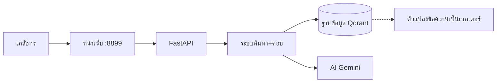
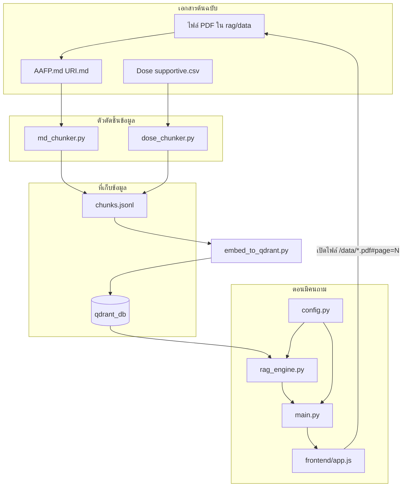
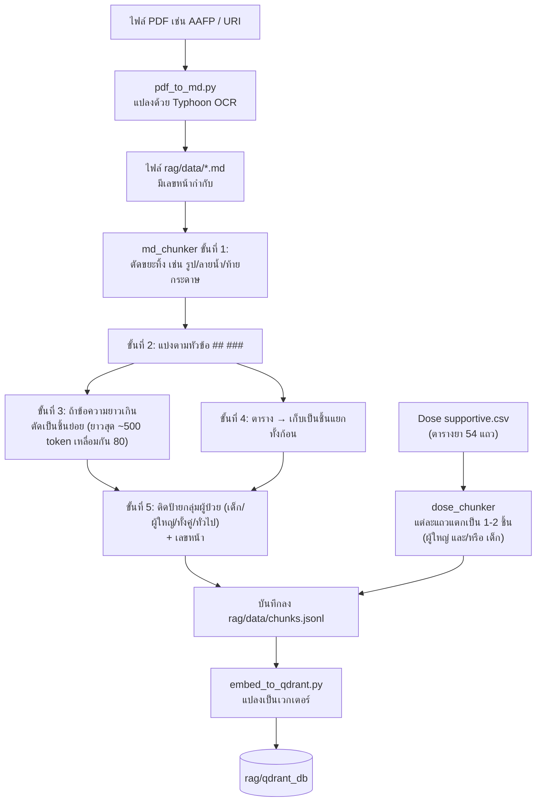
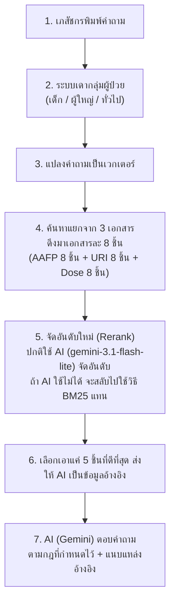

# คู่มือส่งต่องาน — โปรเจกต์ PharmaCare AI
*(ฉบับปรับให้อ่านง่าย — อัปเดตล่าสุด 13 ก.ค. 2026)*

> 📌 **งานที่ต้องทำต่อ:** ปรับปรุงคุณภาพ "คำตอบ" ของ AI (เขียน prompt ให้ดีขึ้น)
> ส่วนของ "การค้นหาข้อมูล" (retrieve) ทำเสร็จแล้ว ใช้ได้ดีพอสมควร

---

## 1) โปรเจกต์นี้คืออะไร (ภาพรวม)

**PharmaCare AI** คือแชทบอทสำหรับเภสัชกร ใช้ถาม-ตอบเรื่อง:
- โรคติดเชื้อทางเดินหายใจส่วนบน (เรียกย่อว่า **URI**)
- การใช้ยาปฏิชีวนะ
- ขนาดยา (Dose)

โดย AI จะไปอ้างอิงจากเอกสารจริง 3 แหล่ง (ไม่ได้ตอบมั่ว):

| แหล่งข้อมูล | เนื้อหาคืออะไร |
|--------|---------|
| **AAFP 2022** | แนวทางการใช้ยาปฏิชีวนะรักษา URI (ต่างประเทศ) |
| **URI เด็ก 2562** | แนวทางเวชปฏิบัติของไทย สำหรับเด็ก |
| **Dose supportive** | ตารางขนาดยาและข้อห้ามใช้ (ดึงจากไฟล์ CSV แล้วเปิด PDF หน้าที่ตรงกันได้) |

**เทคโนโลยีที่ใช้:** FastAPI (ฝั่งเซิร์ฟเวอร์) + Qdrant (ฐานข้อมูลค้นหา) + Gemini (AI ของ Google ทำหน้าที่แปลงข้อความเป็นเวกเตอร์ และตอบคำถาม) + หน้าเว็บ HTML/JS ธรรมดา

**วิธีเปิดใช้งาน:** รันผ่าน Docker แล้วเข้าเว็บที่ **http://localhost:8899**



---

## 2) โครงสร้างไฟล์ในโปรเจกต์

```
d:/Fast/
├── backend/                    # โค้ดฝั่งเซิร์ฟเวอร์ + ระบบค้นหา-ตอบ (RAG)
│   ├── config.py               # ★ ไฟล์รวมค่า path + ชื่อโมเดล + ค่าตั้งต่างๆ (แก้ที่นี่ที่เดียว)
│   ├── main.py                 # จุดรับ-ส่งข้อมูลของเว็บ (API)
│   ├── rag_engine.py           # หัวใจของระบบ: ค้นข้อมูล → จัดอันดับ → ให้ AI ตอบ (มี SYSTEM_PROMPT อยู่ในนี้)
│   ├── md_chunker.py           # ตัวตัดไฟล์ AAFP.md / URI.md ให้เป็นชิ้นเล็กๆ
│   ├── dose_chunker.py         # ตัวตัดไฟล์ตารางยา (CSV) ให้เป็นชิ้นเล็กๆ
│   ├── embed_to_qdrant.py      # เอาชิ้นข้อมูลไปแปลงเป็นเวกเตอร์แล้วเก็บลงฐานข้อมูล
│   ├── patient_group.py        # ตัวเดา/กรองว่าเป็นข้อมูลของ "เด็ก" หรือ "ผู้ใหญ่"
│   ├── auth.py                 # ระบบ login (ยืนยันตัวตน)
│   ├── session_manager.py      # เก็บประวัติแชท (ฐานข้อมูล SQLite)
│   ├── semantic_memory.py      # ความจำระยะยาวของ AI (เก็บใน Qdrant)
│   └── patient_summary.py      # ตัวสรุปข้อมูลผู้ป่วย (มี SUMMARY_PROMPT อยู่ในนี้)
│
├── rag/                         # ★ โซนเก็บความรู้และขั้นตอนเตรียมข้อมูล
│   ├── data/                    # ไฟล์เอกสารต้นฉบับ + ข้อมูลที่ระบบใช้งานจริง
│   │   ├── AAFP.md / URI.md
│   │   ├── Dose supportive.csv (+ ไฟล์ .pdf)
│   │   ├── AAFP_2022_Original.pdf / P2_URI.pdf
│   │   ├── chunks.jsonl        # ผลลัพธ์การตัดชิ้นข้อมูลทั้งหมด (ตอนนี้มี 229 ชิ้น)
│   │   ├── users.json / chat_history.db / test_case.csv
│   ├── qdrant_db/               # ฐานข้อมูลเวกเตอร์ที่ใช้งานจริง
│   ├── pipeline.py             # คำสั่งรวม: ตัดชิ้นข้อมูล + แปลงเป็นเวกเตอร์
│   └── embed_log.txt
│
├── frontend/                   # หน้าเว็บ (แก้แล้วรีเฟรชเห็นผลทันที ไม่ต้อง build ใหม่)
│   ├── index.html / login.html / …
│   ├── js/app.js               # โค้ดหน้าแชท, เปิด PDF ไปหน้าที่ตรงกัน
│   └── css/styles.css
│
├── experiments/chunking/       # ไฟล์ทดลองวัดผลการค้นหา (ไม่ใช่ระบบจริง)
├── readme/                     # เอกสารประกอบ: README, plan_2, STRATEGY_C, CHANGELOG
├── docker-compose.yml
├── Dockerfile
├── .env                         # เก็บ GOOGLE_API_KEY, JWT_SECRET
├── pipeline.py                  # ตัวเชื่อมไปที่ rag/pipeline.py
└── HANDOFF_Uncle_Jack.md        # ไฟล์นี้เอง
```

### ความสัมพันธ์ของไฟล์ (เอกสาร → ข้อมูลที่ค้นได้)



**กติกาสำคัญ:** ห้ามพิมพ์ path ตายตัว (hardcode) ในโค้ดใหม่ — ให้ import path มาจาก `backend/config.py` เสมอ

---

## 3) วิธีรันแอป

### วิธีที่แนะนำ: ใช้ Docker

```bash
docker compose up --build
```

จากนั้นเปิดเว็บที่ **http://localhost:8899**

| จุดไหน | พอร์ต | ความหมาย |
|--------|-------|----------|
| เบราว์เซอร์ของคุณ | **8899** | ใช้พอร์ตนี้เข้าแอป |
| ข้างในคอนเทนเนอร์ (uvicorn) | **8000** | พอร์ตที่เซิร์ฟเวอร์ฟังอยู่ภายใน |
| ใน `docker-compose.yml` | `8899:8000` | คือการแมปจาก host (เครื่องเรา) ไป container |

ถ้าเห็น log ว่า `Uvicorn running on http://0.0.0.0:8000` **ไม่ต้องตกใจ ปกติ**
แค่อย่าไปเปิด `:8000` เอง — ให้เปิด **`:8899`** เท่านั้น

**เรื่องการแก้ไขไฟล์:** โฟลเดอร์ต่อไปนี้ผูก (mount) กับ container ไว้แล้ว แก้แล้วเห็นผลทันที ไม่ต้อง build ใหม่:

| ไฟล์ในเครื่องเรา | ไปอยู่ใน container ที่ |
|------|-----------|
| `./backend` | `/app/backend` |
| `./frontend` | `/app/frontend` |
| `./rag/data` | `/app/rag/data` |
| `./rag/qdrant_db` | `/app/rag/qdrant_db` |
| `./.env` | `/app/.env` |

- ต้อง `docker compose up --build` ใหม่ **เฉพาะเมื่อ**: แก้ `Dockerfile` หรือ `requirements.txt`
- แก้ `backend/` หรือ `frontend/` → แค่ **restart หรือรีเฟรชหน้าเว็บ** ก็พอ

### วิธีรันแบบไม่ใช้ Docker (รันตรงในเครื่อง)

```bash
uvicorn backend.main:app --reload --host 0.0.0.0 --port 8000
# แล้วเปิด http://localhost:8000
```

ต้องมีไฟล์ `.env` ที่มี `GOOGLE_API_KEY` อยู่ด้วย

---

## 4) เบื้องหลังการทำงานของระบบ

### 4.1) ขั้นตอน "ตัดข้อมูลเป็นชิ้นๆ" (Chunk) จากเอกสาร ไปจนถึงเก็บใน Qdrant

> 💡 **Chunk คืออะไร:** การตัดเอกสารยาวๆ ให้เป็นชิ้นเล็กๆ (เหมือนตัดหนังสือเป็นย่อหน้า) เพื่อให้ AI ค้นหาและดึงมาใช้ตอบคำถามได้ง่ายขึ้น

#### ตารางไฟล์ที่เกี่ยวข้องกับการตัด chunk

| ไฟล์ | ทำหน้าที่อะไร | ใช้ตอนไหน |
|------|--------|-----------|
| `backend/pdf_to_md.py` | แปลง PDF → ข้อความ Markdown (ใช้ OCR ยี่ห้อ Typhoon) พร้อมใส่เครื่องหมาย `<!-- PAGE N -->` บอกเลขหน้า | เมื่อมี PDF ใหม่ หรืออยากทำ OCR ใหม่ |
| `backend/md_chunker.py` | ตัดไฟล์ `.md` (AAFP / URI) เป็นชิ้นๆ ตามวิธี "Strategy C" | ตอนรัน pipeline |
| `backend/dose_chunker.py` | อ่านไฟล์ **Dose CSV** (ตารางยา) → ตัดเป็นชิ้นข้อมูลยา (ไม่ผ่าน OCR หรือ Strategy C) | ตอนรัน pipeline |
| `backend/patient_group.py` | ติดป้ายให้แต่ละชิ้นข้อมูลว่าเป็นของ "เด็ก/ผู้ใหญ่/ทั่วไป" | ถูกเรียกใช้จาก md_chunker |
| `backend/embed_to_qdrant.py` | อ่านไฟล์ `chunks.jsonl` → แปลงเป็นเวกเตอร์ → เก็บลง Qdrant | ตอนรัน pipeline |
| `rag/pipeline.py` | คำสั่งรวม: ตัด chunk จากทุกแหล่ง → รวมเป็นไฟล์เดียว → แปลงเป็นเวกเตอร์ | คำสั่งหลักที่เรารัน |
| `rag/data/AAFP.md`, `URI.md` | เอกสารหลังผ่าน OCR แล้ว | ใช้เป็นอินพุตของ md_chunker |
| `rag/data/Dose supportive.csv` | ตารางยา | ใช้เป็นอินพุตของ dose_chunker |
| `rag/data/chunks.jsonl` | **ผลลัพธ์รวม** — 1 บรรทัด = ข้อมูล 1 ชิ้น (เปิดดูด้วยตาได้) | ใช้ตรวจสอบก่อนแปลงเป็นเวกเตอร์ / ดีบัก |
| `rag/qdrant_db/` | ฐานข้อมูลเวกเตอร์ที่แอปใช้ค้นหาจริงตอนมีคนถาม | ใช้งานจริง (production) |
| `backend/config.py` | บอก path ต่างๆ + รายชื่อไฟล์ MD / Dose CSV | ใช้ทุกขั้นตอน |

**สรุปเรื่อง Dose (ตารางยา):** ไม่ต้องผ่าน OCR ไม่ต้องผ่าน Strategy C — อ่านแถวจากไฟล์ CSV มาแปลงตรงๆ แล้วเขียนรวมกับข้อมูล AAFP/URI ลงไฟล์ `chunks.jsonl`
ดูตัวอย่างได้ที่ `rag/data/chunks.jsonl` (ค้นคำว่า `dose_` หรือ `"source": "Dose"`)

**จำนวนชิ้นข้อมูลตอนนี้ทั้งหมด 229 ชิ้น** แบ่งเป็น: AAFP 38 ชิ้น + URI 94 ชิ้น + Dose 97 ชิ้น

#### ภาพรวมขั้นตอนทั้งหมด (แผนภาพ)



#### ตัวอย่างการตัด chunk แบบง่ายๆ

**A) เอกสาร AAFP / URI (มาจากไฟล์ .md)**

```text
ในไฟล์ .md มีหัวข้อ + ย่อหน้ายาว + ตาราง
        │
        ├─ ตัดลายน้ำ / รูปภาพออก
        ├─ ข้อความที่อยู่ใต้หัวข้อเดียวกัน → รวมเป็นชิ้นเดียว
        ├─ ถ้ายาวเกินไป → หั่นเป็นหลายชิ้น (ให้เนื้อหาทับกันเล็กน้อย)
        ├─ ถ้าเจอตาราง → แยกเก็บเป็นชิ้นตารางต่างหาก
        └─ ติดป้ายกำกับ เช่น กลุ่มผู้ป่วย=เด็ก, เลขหน้า=20
```

ตัวอย่างในไฟล์ `chunks.jsonl` (แบบย่อ):

```text
[แหล่งข้อมูล: AAFP | หน้า: 2 | หัวข้อ: ... > ตาราง]
[บริบท: ...]
<table>...</table>
```

**B) ข้อมูลยา (Dose) — มาจาก CSV คนละวิธีกับข้างบน**

```text
1 แถว = ยา 1 ชนิด เช่น Paracetamol
  ├─ ถ้ามีข้อมูลขนาดยาผู้ใหญ่ → สร้าง 1 ชิ้น (กลุ่ม=ผู้ใหญ่, หน้า=13)
  └─ ถ้ามีข้อมูลขนาดยาเด็ก    → สร้าง 1 ชิ้น (กลุ่ม=เด็ก, หน้า=13)
→ รวมแล้วได้ประมาณ 97 ชิ้น จาก 54 แถว (ไม่ใช่ 54 ชิ้นตรงๆ เพราะบางแถวแตกเป็น 2 ชิ้น)
```

ตัวอย่างในไฟล์ `chunks.jsonl` (แบบย่อ):

```text
[แหล่งข้อมูล: Dose | หน้า: 13 | ชื่อยา: Paracetamol | กลุ่ม: ผู้ใหญ่]
ชื่อยา: Paracetamol
ขนาดยา (ผู้ใหญ่): ...
อ้างอิง: Dose หน้า 13 (Dose supportive.pdf)
```

#### ถ้าต้องแปลงข้อมูลเป็นเวกเตอร์ใหม่ (re-embed) หรือทำ index ใหม่

ให้ปิดแอปก่อน (กันฐานข้อมูลล็อก) แล้วอยู่ในโฟลเดอร์โปรเจกต์ พิมพ์:

```bash
docker compose down

python rag/pipeline.py --reset
# คำสั่งนี้จะ: ลบ chunks.jsonl และ qdrant_db เดิมทิ้ง
# แล้วตัด chunk ใหม่ทั้งหมด (AAFP/URI/Dose) → แปลงเป็นเวกเตอร์ใหม่ทั้งหมด

docker compose up --build
```

หรือจะทำทีละขั้นตอนก็ได้:

```bash
python rag/pipeline.py --chunk-only   # สร้างแค่ chunks.jsonl (เปิดดูตรวจสอบได้ก่อน)
python rag/pipeline.py --embed-only   # เอา jsonl ที่มีอยู่ไปแปลงเป็นเวกเตอร์อย่างเดียว
```

ถ้ามี PDF เล่มใหม่ทั้งเล่ม → ต้อง OCR ด้วย `pdf_to_md.py` ให้ได้ไฟล์ `.md` ก่อน แล้วค่อยรัน `--reset`

อ่านรายละเอียดเรื่อง Strategy C เพิ่มเติมได้ที่: `readme/STRATEGY_C_explained.md`

---

### 4.2) ขั้นตอนตอนมีคนถามคำถาม (RAG แบบสรุปสั้นๆ)



**พูดง่ายๆ:** ถาม → ไปหาชิ้นข้อมูลที่เกี่ยวข้องจาก 3 เอกสาร (ดึงมาก่อนเอกสารละ 8 ชิ้น) → จัดอันดับใหม่ว่าชิ้นไหนตรงคำถามที่สุด → เหลือแค่ 5 ชิ้นที่ดีที่สุด → ส่งให้ AI อ่านแล้วตอบ

#### โมเดล AI ที่ใช้ + ค่าตั้งต่างๆ (knobs)

| ใช้ทำอะไร | ใช้โมเดล/ค่าอะไร | ไปแก้ที่ไหน |
|-------|-----|--------|
| แปลงข้อความเป็นเวกเตอร์ | `models/gemini-embedding-001` | `config.py` → ตัวแปร `EMBED_MODEL` |
| ตอบคำถามในแชท | `models/gemini-3.1-flash-lite` | ตัวแปร `CHAT_MODEL` |
| จัดอันดับใหม่ (rerank) แบบปกติ | ใช้โมเดลตัวเดียวกับตอนตอบแชท | ตัวแปร `RERANK_MODE=llm` |
| จำนวนชิ้นที่ดึงมาต่อเอกสาร 1 แหล่ง | **8 ชิ้น** | ตัวแปร `PER_SOURCE_TOP_K` |
| จำนวนชิ้นสุดท้ายที่ส่งให้ AI ตอบ | **5 ชิ้น** | ตัวแปร `TOP_K` |
| วิธีจัดอันดับ (เลือกได้) | `llm` (ใช้ AI) / `bm25` (นับคำ) / `vector` (ระยะเวกเตอร์) | ตั้งค่าผ่าน env `RERANK_MODE` |

โค้ดหลักของส่วนนี้อยู่ที่ `backend/rag_engine.py` (prompt ก็อยู่ในไฟล์นี้เช่นกัน)

---

### 4.3) Backend (ฝั่งเซิร์ฟเวอร์) แต่ละไฟล์ทำอะไรบ้าง

| ไฟล์ | หน้าที่ |
|------|---------|
| `main.py` | จุดรับ-ส่งข้อมูลหลัก (API): login, สตรีมคำตอบแชท, จัดการ session, ข้อมูลผู้ป่วย, เทสเคส; เปิดให้เข้าถึง `/static` และ `/data` |
| `rag_engine.py` | หัวใจของระบบ RAG + เก็บ **SYSTEM_PROMPT** / เทมเพลตข้อความผู้ใช้ / prompt สำหรับ rerank |
| `config.py` | เก็บ path + ชื่อโมเดล + ค่าตั้งต่างๆ ทั้งหมด |
| `md_chunker.py` / `dose_chunker.py` | สร้างชิ้นข้อมูล (chunks) |
| `embed_to_qdrant.py` | เขียนเวกเตอร์ลงฐานข้อมูล |
| `patient_group.py` | เดา/กรองว่าเป็นข้อมูลกลุ่มผู้ป่วยไหน |
| `auth.py` | ระบบ login + JWT (อ้างอิงจากไฟล์ `users.json`) |
| `session_manager.py` | บันทึกประวัติแชทลง SQLite |
| `semantic_memory.py` | ความจำที่อยู่ข้าม session เก็บใน Qdrant (คอลเลกชันชื่อ `chat_memory`) |
| `patient_summary.py` | สรุปข้อมูลผู้ป่วย + เก็บ **SUMMARY_PROMPT** |
| `pdf_to_md.py` | ทำ OCR แปลง PDF → MD (ไม่ต้องรันทุกครั้ง เฉพาะเมื่อมี PDF ใหม่) |

---

### 4.4) หน้าเว็บ (Frontend) + บัญชีผู้ใช้

| หน้า | ไฟล์ | ทำอะไร |
|------|------|--------|
| หน้าแชทหลัก | `frontend/index.html` + `js/app.js` | ส่งคำถาม, สตรีมคำตอบ, แสดงแหล่งอ้างอิง, เปิด PDF |
| หน้า Login | `login.html` | เข้าสู่ระบบ |
| หน้าผู้ป่วย | `patients.html` / `patient.html` | แสดงรายชื่อผู้ป่วย + สรุปข้อมูล |
| หน้าเทสเคส | `testcase.html` | รันชุดทดสอบจากไฟล์ CSV |

วิธีเปิดไฟล์ PDF: ใช้ `/data/ชื่อไฟล์.pdf#page=N` (ห้ามต่อ `&search=` ต่อท้าย hash เดี๋ยวพัง)

#### บัญชีผู้ใช้ในระบบ (เก็บอยู่ที่ `rag/data/users.json`)

| Username | Password | บทบาท |
|----------|----------|--------|
| `admin` | `123` | ผู้ดูแลระบบ (ค่าเริ่มต้นจาก `auth.py`) |
| `pharmacist1` | *(รหัสที่ตั้งไว้ตอนสร้าง user)* | เภสัชกร |
| `pharmacist2` | *(รหัสที่ตั้งไว้ตอนสร้าง user)* | เภสัชกร |
| `pharmacist3` | *(รหัสที่ตั้งไว้ตอนสร้าง user)* | เภสัชกร |
| `pharmacist4` | *(รหัสที่ตั้งไว้ตอนสร้าง user)* | เภสัชกร |
| `pharmacist5` | *(รหัสที่ตั้งไว้ตอนสร้าง user)* | เภสัชกร |

> ⚠️ รหัสผ่านของ pharmacist ถูกเก็บแบบ hash (เข้ารหัสไว้) ใน `users.json` — ให้ใส่รหัสจริงลงในตารางนี้ก่อนส่งต่อให้ Uncle_Jack
> ถ้าจะรีเซ็ต/เพิ่มผู้ใช้ ให้ดูฟังก์ชัน `add_user` ใน `backend/auth.py`

---

## 5) ปัญหาเดิม 9 ข้อ — ตอนนี้แก้ไปถึงไหนแล้ว

| # | ปัญหา | สถานะ | หมายเหตุ |
|---|--------|--------|----------|
| 1 | ระบบอ้างอิงผิดกลุ่มผู้ป่วย (เด็ก↔ผู้ใหญ่สลับกัน) | ✅ แก้แล้วบางส่วน | ใช้ `patient_group` + การกรอง |
| 2 | เลขหน้าที่แสดงกับเนื้อหาไม่ตรงกัน | ✅ แก้แล้วบางส่วน | ปรับ parser + ใช้ `journal_page`; หน้าเว็บใช้ `page` ในการเปิด PDF |
| 3 | คำตอบที่อ้างจากภายนอกไม่มีลิงก์ URL | ❌ ยังไม่แก้ | **เป็นงานที่ต้องแก้ผ่าน prompt** |
| 4 | AI ผสมข้อมูลจาก Guideline กับความรู้ทั่วไปโดยไม่บอก | ❌ ยังไม่แก้ | **เป็นงานที่ต้องแก้ผ่าน prompt** |
| 5 | ข้อมูลขนาดยาเด็กไม่มีค่า Min–Max | ✅ แก้แล้วในชั้นข้อมูล | มีข้อมูล Dose อยู่ใน RAG แล้ว แต่ยังไม่มีการคำนวณ mL |
| 6 | ยังไม่สามารถคำนวณปริมาณยา (mL) จากความแรงยา | 🔮 ยังไม่ได้ทำ (แผนอนาคต) | — |
| 7 | AI ยังไม่เทียบความต่างระหว่าง URI กับ AAFP | ✅ แก้แล้วบางส่วน | ดึงข้อมูลทั้งสองเล่มมาได้แล้ว แต่ยังไม่ได้บังคับให้ AI เทียบในคำตอบ |
| 8 | ดึงข้อมูลผิดหัวข้อ / ผิดเล่ม | ✅ แก้แล้ว | ใช้ Strategy C + ดึงแยกตามแหล่ง + ให้ AI ช่วยจัดอันดับ (rerank) |
| 9 | เด็กอายุต่ำกว่า 4 ปี กับยาแก้ไอ (ควรระวังเป็นพิเศษ) | ✅ แก้แล้วบางส่วน | การค้นหาดีขึ้นแล้ว แต่ยังไม่มีระบบเตือนความปลอดภัย (safety gate) |

รายละเอียดเพิ่มเติม: `readme/plan_2.md`
ผลการวัดคุณภาพการค้นหา (Retrieve) รอบที่ 3 จาก 25 เคสทดสอบ:
- ค้นถูกแหล่งเอกสาร: **100%**
- ความแม่นยำของอันดับ (MRR): **0.695**
- ความถูกต้องของเลขหน้าวารสาร: **0.64**

---

## สำหรับ Uncle_Jack — ถ้าจะปรับปรุง prompt ต้องแก้ไฟล์ไหน

### จุดที่ต้องแก้หลักๆ (เริ่มที่นี่ก่อน)

ไฟล์: **`backend/rag_engine.py`**

| ตัวแปร / ช่วงบรรทัด | อยู่ประมาณบรรทัดที่ | ใช้ทำอะไร |
|---------------|-----------------|-----------|
| `SYSTEM_PROMPT` | ~35–89 | กำหนดบทบาทของ AI, ประเภทคำถาม (1–4), กฎการอ้างอิง, รูปแบบคำตอบ |
| `USER_MESSAGE_TEMPLATE` | ~93–103 | เทมเพลตที่ห่อคำถาม + ข้อมูลอ้างอิง ก่อนส่งให้ AI ตอบ |
| prompt ในฟังก์ชัน `_llm_rerank` | ~350–370 | สั่งให้ AI จัดอันดับข้อมูลที่ค้นเจอ (ผลลัพธ์เป็น JSON `ranked_ids`) |
| prompt ในฟังก์ชัน `evaluate_answer_llm` | ~810 เป็นต้นไป | ใช้ให้คะแนนคำตอบ (ถ้ามีการใช้ฟังก์ชันนี้) |
| prompt ในฟังก์ชัน `summarize_history` | ~857 เป็นต้นไป | สรุปประวัติการแชทที่ยาวเกินไป |

ไฟล์รอง (เกี่ยวข้องแต่ไม่ใช่จุดหลัก):

| ไฟล์ | ตัวแปร | ใช้เมื่อไหร่ |
|------|--------|----------|
| `backend/patient_summary.py` | `SUMMARY_PROMPT` | ใช้ตอนสรุปข้อมูลผู้ป่วยในหน้า patients |

### สิ่งที่ควรโฟกัสถ้าจะแก้ prompt (แก้ปัญหาข้อ 3, 4, 7 ด้านบน)

1. **บังคับให้มี URL ในการอ้างอิง** เวลาที่ AI ใช้ความรู้จากภายนอก (แก้ปัญหาข้อ 3)
2. **แยกให้ชัดเจน** ระหว่าง "ข้อมูลจาก Guideline ในระบบ" กับ "ความรู้ทั่วไปของ AI" — ห้ามปนกันโดยไม่บอกผู้ใช้ (แก้ปัญหาข้อ 4)
3. **เมื่อมีข้อมูลทั้ง URI และ AAFP อยู่ในบริบทเดียวกัน** ให้ AI เทียบความต่าง เช่น ระยะเวลาการรักษา (แก้ปัญหาข้อ 7)
4. **เรื่องขนาดยา (Dose):** ย้ำในกฎว่าตัวเลขขนาดยาต้องมาจากข้อมูลที่ค้นเจอเท่านั้น **ห้าม AI แต่งตัวเลขขึ้นเอง**

หลังแก้ `SYSTEM_PROMPT` เสร็จ: เพราะโฟลเดอร์ `backend/` ผูก (mount) กับ container ไว้แล้ว → แค่ `docker compose restart` หรือรอระบบโหลดใหม่ แล้วลองถามคำถามใหม่ได้เลย
**ไม่ต้อง** รัน `pipeline.py --reset` (เพราะการแก้ prompt ไม่เกี่ยวกับการแปลงข้อมูลเป็นเวกเตอร์)

---

## ⚠️ ข้อควรระวัง (อ่านก่อนพัง)

1. **เรื่องพอร์ต:** ใช้พอร์ต **8899** ในเบราว์เซอร์เสมอ — ถึงแม้ log ของ uvicorn จะขึ้นว่าพอร์ต 8000 ก็ไม่ใช่บัค เป็นเรื่องปกติ
2. **ฐานข้อมูล Qdrant ล็อก:** อย่ารันคำสั่ง `rag/pipeline.py` บนเครื่อง (host) พร้อมๆ กับตอนที่ container กำลังเปิดฐานข้อมูลอยู่ (จะชนกัน)
3. **ห้ามพิมพ์ path ตายตัว (hardcode)** — ให้ดึงค่าจาก `backend/config.py` เสมอ
4. **แก้ backend แล้วอย่าลืม:** เพราะผูก (mount) ไว้แล้ว แค่ restart ก็พอ — ต้อง build ใหม่ (`--build`) เฉพาะตอนเปลี่ยน dependency เท่านั้น
5. **ไฟล์ Dose PDF:** ต้องวางไว้ที่ `rag/data/Dose supportive.pdf` ไม่งั้นตอนกดเปิดแหล่งอ้างอิงของ Dose จะขึ้น error 404 (หาไฟล์ไม่เจอ)
6. **เลขหน้าของ AAFP มี 2 แบบ อย่าสับสน:** `page` = เลขหน้าของไฟล์ PDF ที่ใช้เปิดในหน้าเว็บ ส่วน `journal_page` = เลขหน้าตามวารสารต้นฉบับ (ใช้ตอนวัดผล) — คนละค่ากัน
7. **โฟลเดอร์ `experiments/`** เป็นแค่ไฟล์ทดลอง **ไม่ใช่ระบบที่ใช้งานจริง** — อย่าไปสับสนกับ `rag/qdrant_db` ที่เป็นของจริง
8. **คุณภาพคำตอบของ AI** ยังไม่ถึงระดับที่เภสัชกรพอใจ — ตัวเลขที่วัดได้ในรอบที่ 3 เป็นแค่การวัด "การค้นหา" (retrieve) เท่านั้น ยังไม่ได้วัดคุณภาพคำตอบจริง
9. **แพ็กเกจ `google.generativeai` เลิกใช้แล้ว (deprecated)** — ยังไม่ได้ย้ายไปใช้ `google.genai` (อย่าเอามาปนกับงานแก้ prompt ถ้าไม่จำเป็นจริงๆ)

---

## เอกสารอื่นที่เกี่ยวข้อง

| ไฟล์ | เนื้อหา |
|------|---------|
| `readme/README.md` | ภาพรวมโปรเจกต์ + ขั้นตอนการทำงาน |
| `readme/plan_2.md` | สถานะปัญหา 9 ข้อ แบบละเอียด |
| `readme/STRATEGY_C_explained.md` | อธิบายวิธีตัด chunk แบบมีภาพประกอบ |
| `readme/CHANGELOG.md` | บันทึกงานที่ทำล่าสุด |
