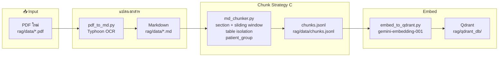
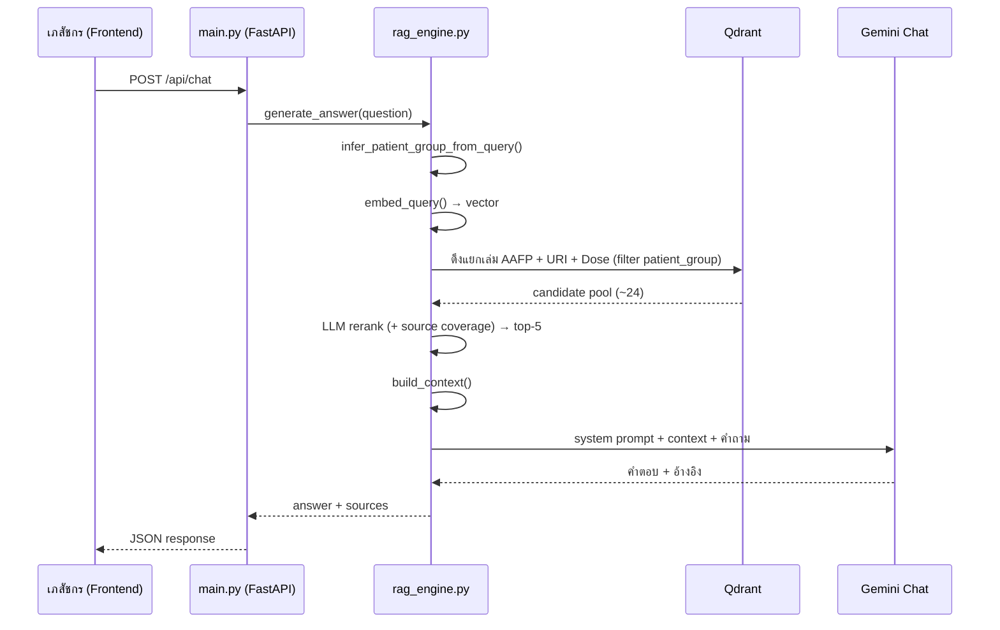
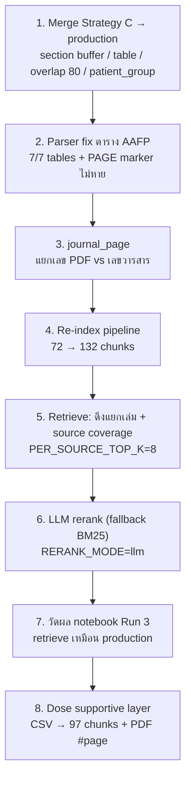
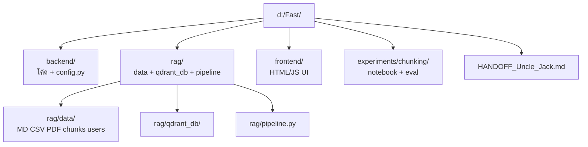
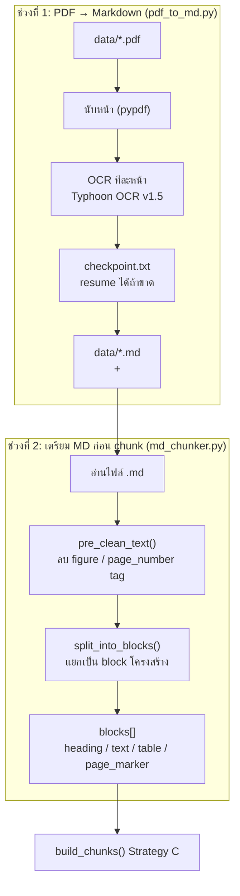
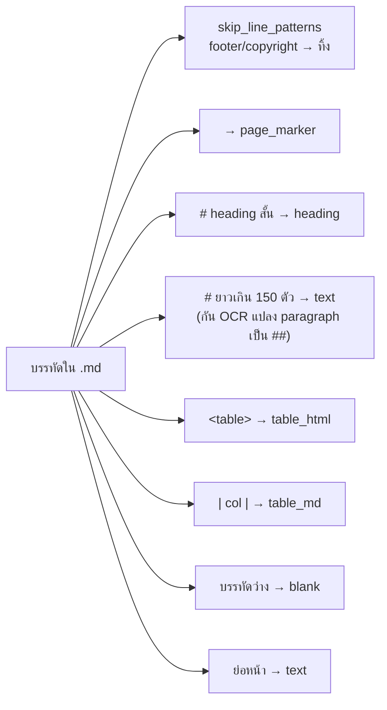
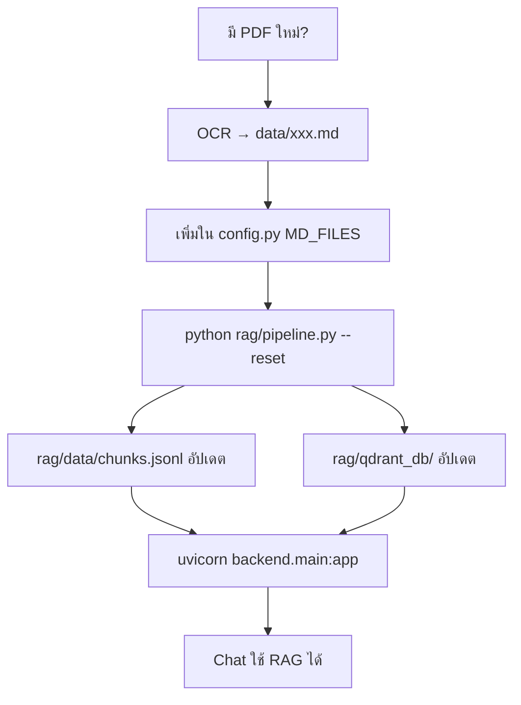

# PharmaCare AI — Fast

RAG chatbot สำหรับเภสัชกร อ้างอิงจากแนวทาง AAFP 2022 และ URI เด็ก 2562  
Backend เป็น FastAPI + Qdrant + Gemini (embed + chat)

---

## ภาพรวมระบบ (Mermaid)

### 1) Data Pipeline — จาก PDF ถึง Vector DB



### 2) Runtime — ตอนผู้ใช้ถามคำถาม



---

## สรุปแผนที่ทำไปแล้ว + ผลทดลอง (อัปเดต 13 Jul 2026)

### ปัญหาเดิมมี 9 ข้อ — แก้ไปถึงไหน

| # | ปัญหา | สถานะ | วิธีแก้หลัก |
|---|---|---|---|
| 1 | อ้างผิดกลุ่มผู้ป่วย (เด็ก↔ผู้ใหญ่) | ✅ บางส่วน | `patient_group` tag + inclusive filter |
| 2 | เลขหน้า / เนื้อหาไม่ตรง | ✅ บางส่วน | parser fix ตาราง + `journal_page` |
| 3 | Ref ภายนอกไม่มี URL | ❌ | ยังไม่ทำ (prompt) |
| 4 | ผสม Guideline + ความรู้ทั่วไป | ❌ | ยังไม่ทำ (prompt) |
| 5 | Dose เด็กไม่มี Min–Max | ✅ | Dose CSV → RAG (ยังไม่มี mL calc) |
| 6 | คำนวณ mL จากความแรงยา | 🔮 | อนาคต |
| 7 | ไม่เทียบ URI + AAFP | ✅ บางส่วน | ดึงแยกเล่มแล้ว (ยังไม่บังคับ LLM เทียบ) |
| 8 | ดึงผิดหัวข้อ / ผิดเล่ม | ✅ | Strategy C + per-source + LLM rerank |
| 9 | เด็ก &lt;4 ปี ยาแก้ไอ | ✅ บางส่วน | ตาราง BEST PRACTICES แยก chunk (ยังไม่มี safety gate) |

รายละเอียดสถานะทีละข้อ: [`plan_2.md`](plan_2.md)  
อธิบาย Strategy C ทีละภาพ: [`STRATEGY_C_explained.md`](STRATEGY_C_explained.md)

### แผนงานที่ทำจริง (ลำดับ)



### Production retrieve ตอนนี้ทำอะไรทีละขั้น

1. อ่านคำถาม → เดา `patient_group` (pediatric / adult / general)
2. Embed คำถาม (`models/gemini-embedding-001`)
3. **ดึงแยกเล่ม:** top 8 จาก AAFP + URI + **Dose** (กรองกลุ่มผู้ป่วยแบบ inclusive)
4. **LLM rerank (default):** โมเดลเดียวกับแชท — `models/gemini-3.1-flash-lite` (`CHAT_MODEL`)  
   จัดอันดับ candidate (~24 ชิ้น) ผ่าน JSON `ranked_ids` — ล้มเหลวแล้ว fallback BM25 (หรือตั้ง `RERANK_MODE=bm25|vector`)
5. **Source coverage:** พยายามให้มีอย่างน้อย 1 chunk ต่อเล่มใน top-5
6. ส่ง context ให้ Gemini ตอบ (แชทก็ใช้ `gemini-3.1-flash-lite`)

ตั้งค่าที่เกี่ยว:

| Env / ค่า | ความหมาย | Default |
|---|---|---|
| `RERANK_MODE` | `llm` / `bm25` / `vector` | `llm` |
| LLM rerank model | = `CHAT_MODEL` ใน `backend/config.py` | `models/gemini-3.1-flash-lite` |
| `PER_SOURCE_TOP_K` | ดึงกี่ชิ้นต่อเล่มก่อน rerank | `8` |
| `TOP_K` | จำนวนสุดท้ายส่ง LLM ตอบ | `5` |

> Path / knobs ทั้งหมดอยู่ที่ **`backend/config.py`** — handoff: [`../HANDOFF_Uncle_Jack.md`](../HANDOFF_Uncle_Jack.md)

### Dose supportive — page ↔ PDF

- Chunk จาก `rag/data/Dose supportive.csv` (`backend/dose_chunker.py`) — ไม่ใช้ Strategy C
- คอลัมน์ **`Page` ใน CSV = เลขหน้าใน `Dose supportive.pdf`** → เปิดอ้างอิง `#page=N` ได้ตรง
- วางไฟล์ PDF ที่ `rag/data/Dose supportive.pdf` (frontend เปิดชื่อนี้เมื่อ source มี "Dose")
- ดึงเป็นแหล่งที่ 3 คู่กับ AAFP/URI

### 3) โครงสร้างโฟลเดอร์หลัก



---

## เบื้องหลังก่อน Chunk — ทำอะไรบ้าง

ก่อน `build_chunks()` (Strategy C) จะรัน ระบบต้องเตรียม **Markdown ที่สะอาดและมีโครงสร้าง** ก่อน แบ่งเป็น 2 ช่วงใหญ่:

### ภาพรวม Pre-Chunk Pipeline



> โปรเจกต์ปัจจุบัน (`AAFP.md`, `URI.md`) **ข้ามช่วงที่ 1** ได้เลย — มี `.md` พร้อมแล้ว  
> `pipeline.py` เริ่มจากช่วงที่ 2 โดยตรง

---

### ช่วงที่ 1: PDF → Markdown (`pdf_to_md.py`)

| ขั้น | ทำอะไร | รายละเอียด |
|---|---|---|
| 1 | ตรวจ API Key | ต้องมี `TYPHOON_API_KEY` ใน `.env` |
| 2 | นับหน้า PDF | ใช้ `pypdf.PdfReader` |
| 3 | OCR ทีละหน้า | เรียก `typhoon-ocr` model v1.5, figure language = Thai |
| 4 | Retry + backoff | 429 → รอ 10→20→40→80→160s, ล้มเหลวสูงสุด 5 ครั้ง/หน้า |
| 5 | Rate limit | หน่วง ~3.5s ระหว่างหน้า (ปลอดภัย 20 req/min) |
| 6 | Checkpoint | บันทึก `xxx_checkpoint.txt` — รันซ้ำข้ามหน้าที่ทำแล้ว |
| 7 | เขียน output | ต่อหน้าด้วย marker `<!-- PAGE N -->` แล้วตามด้วยเนื้อหา OCR |

**Output ตัวอย่าง** (`data/AAFP.md`):

```markdown
<!-- PAGE 1 -->

# Antibiotic Use in Acute Upper Respiratory Tract Infections
...
## Common Cold
...
<table>...</table>
```

OCR ออกมาเป็น Markdown + HTML table + heading (`#` ถึง `####`) — ยังไม่ใช่ chunk

**Log:** `ocr_log.txt`

---

### ช่วงที่ 2: เตรียม Markdown ก่อนแตก chunk (`md_chunker.py`)

เมื่อ `pipeline.py` เรียก `chunk_md_file()` จะทำ 3 ขั้นก่อนถึง Strategy C:

#### 2.1 อ่านไฟล์ + ตั้ง `source_name`

```python
chunk_md_file("data/AAFP.md", source_name="AAFP", config=cfg)
```

`source_name` จะไปอยู่ใน prefix ทุก chunk เช่น `[Source: AAFP | Page: 628 | ...]`

#### 2.2 `pre_clean_text()` — ลบ tag ขยะจาก OCR

| ลบอะไร | เหตุผล |
|---|---|
| `<figure>...</figure>` | รูปประกอบไม่ใช้ใน RAG text |
| `<page_number>N</page_number>` | เลขหน้าซ้ำกับ `<!-- PAGE N -->` แล้ว |
| custom `skip_tags` | ขยายได้ใน `ChunkConfig` |

#### 2.3 `split_into_blocks()` — แปลง MD เป็น block โครงสร้าง

สแกนทีละบรรทัด แล้วจัดประเภท:



**Block types ที่ได้:**

| type | ตัวอย่าง | ใช้ทำอะไรต่อ |
|---|---|---|
| `page_marker` | `<!-- PAGE 628 -->` | อัปเดต `current_page` ตลอดไฟล์ |
| `heading` | `## Common Cold` | สร้าง heading path (`H1 > H2 > H3`) |
| `text` | ย่อหน้าเนื้อหา | รวมใน section buffer ก่อนแตก chunk |
| `table_html` | `<table>...</table>` | แยกเป็น chunk ตาราง 1:1 |
| `table_md` | `\| col \|` | แยกเป็น chunk ตาราง 1:1 |
| `blank` | บรรทัดว่าง | คั่น section (Strategy C ไม่ merge ข้าม heading) |

**บรรทัดที่ถูกทิ้ง** (AAFP มีเยอะ):

- `Downloaded from the American Family Physician...`
- `CME This clinical content...`
- `Author disclosure:`
- `Patient information:`
- `All other rights reserved`

#### 2.4 จาก blocks → chunk (Strategy C)

หลังได้ `blocks[]` แล้วถึงเข้า `build_chunks()`:

1. สะสม `text` ใน **section buffer** จนเจอ heading ใหม่ / ตาราง
2. flush buffer → sliding window (max 500 tok, overlap 80)
3. ตาราง → chunk แยกทันที
4. ติด `patient_group` จาก `patient_group.py`
5. ติด prefix `[Source | Page | Section]` + `[Context: section]`

---

### สรุป: ก่อน chunk vs หลัง chunk

| ช่วง | ไฟล์/ฟังก์ชัน | Output |
|---|---|---|
| PDF → MD | `pdf_to_md.py` | `data/*.md` + `ocr_log.txt` |
| Pre-clean | `pre_clean_text()` | string ที่ไม่มี figure/page_number tag |
| Parse | `split_into_blocks()` | `list[dict]` โครงสร้าง block |
| Chunk | `build_chunks()` | `list[dict]` พร้อม metadata |
| บันทึก | `save_chunks_jsonl()` | **`rag/data/chunks.jsonl`** |

---

## Backend ทำอะไรบ้าง

| โมดูล | หน้าที่ |
|---|---|
| **`main.py`** | FastAPI server — auth, chat, sessions, patients, test cases |
| **`rag_engine.py`** | RAG หลัก: embed query → ค้น Qdrant → ส่ง context ให้ Gemini ตอบ |
| **`md_chunker.py`** | แปลง `.md` → chunks (Strategy C) |
| **`dose_chunker.py`** | แปลง `Dose supportive.csv` → dose chunks (page = PDF page) |
| **`embed_to_qdrant.py`** | embed chunks → อัปโหลด Qdrant |
| **`patient_group.py`** | ติด tag เด็ก/ผู้ใหญ่/ทั่วไป ทั้งตอน chunk และตอน retrieve |
| **`pdf_to_md.py`** | OCR PDF → Markdown (Typhoon API) |
| **`session_manager.py`** | จัดการ chat sessions ต่อผู้ใช้/ผู้ป่วย |
| **`semantic_memory.py`** | ความจำเชิงความหมายข้าม session |
| **`patient_summary.py`** | สรุปประวัติผู้ป่วยด้วย AI |
| **`auth.py`** | Login / token / users.json |

### Chunking Strategy C (production ปัจจุบัน)

- แบ่งตาม **heading section** ไม่ใช่ recursive แบบเก่า
- ข้อความยาวใช้ **sliding window** (max 500 tokens, overlap 80)
- **ตารางแยก chunk 1:1** ไม่ merge กับ paragraph (+ parser fix `</table>`)
- ทุก chunk มี prefix `[Source | Page | Section]` + `[Context: section]`
- metadata `patient_group` + **`journal_page`** (เลขวารสาร AAFP)
- ตอน retrieve: **filter → ดึงแยกเล่ม → LLM rerank → top-k**

---

## ไฟล์สำคัญ — เก็บที่ไหน

| ไฟล์ / โฟลเดอร์ | ที่อยู่ | คำอธิบาย |
|---|---|---|
| PDF ต้นฉบับ | `rag/data/*.pdf` | วาง PDF ใหม่ที่นี่ (ถ้ามี) |
| Markdown หลัง OCR | `rag/data/AAFP.md`, `rag/data/URI.md` | แหล่งข้อมูลก่อน chunk |
| **Chunks ทั้งหมด** | **`rag/data/chunks.jsonl`** | 1 บรรทัด = 1 chunk (JSON) |
| Vector DB | `rag/qdrant_db/` | embedding สำหรับค้นหา (production) |
| Embed log | `rag/embed_log.txt` | log ตอน embed |
| Config กลาง | `backend/config.py` | paths + RAG knobs |
| Handoff | `HANDOFF_Uncle_Jack.md` | สรุปให้ผู้รับไม้ |
| OCR log | `ocr_log.txt` | log ตอน OCR (ถ้ารัน pdf_to_md) |
| Experiment เก่า | `experiments/chunking/` | notebook, eval DB — ไม่ใช้ production |

### รูปแบบ 1 chunk ใน `chunks.jsonl`

```json
{
  "chunk_id": "URI_0017",
  "source": "URI",
  "page": 20,
  "heading": "โรคหวัด (Common cold) > ลักษณะอาการทางคลินิก",
  "type": "text",
  "content": "[Source: URI | Page: 20 | Section: ...]\n\n[Context: ...]\n...",
  "tokens_approx": 214,
  "patient_group": "pediatric",
  "journal_page": 629
}
```

ปัจจุบันมี **229 chunks** (AAFP 38 + URI 94 + Dose 97)

---

## ถ้ามี PDF ใหม่ — ทำยังไง

### ขั้นตอนที่ 1: PDF → Markdown

```bash
# จาก project root (d:\Fast)
python -c "
from backend.pdf_to_md import pdf_to_md
pdf_to_md('data/ชื่อไฟล์.pdf', 'data/ชื่อไฟล์.md')
"
```

ต้องมี `TYPHOON_API_KEY` ใน `.env`  
Output จะมี marker `<!-- PAGE N -->` ทุกหน้า — chunker ใช้ track หมายเลขหน้า

### ขั้นตอนที่ 2: เพิ่มไฟล์ใน pipeline

แก้ `backend/config.py` — เพิ่มใน `MD_FILES`:

```python
MD_FILES = [
    (str(DATA_DIR / "AAFP.md"), "AAFP"),
    (str(DATA_DIR / "URI.md"),  "URI"),
    (str(DATA_DIR / "ชื่อใหม่.md"), "ชื่อ_source"),  # ← เพิ่มบรรทัดนี้
]
```

`source_name` จะไปอยู่ใน field `source` ของทุก chunk และ Qdrant payload

### ขั้นตอนที่ 3: Chunk + Embed

```bash
# รันใหม่ทั้งหมด (ลบ rag/qdrant_db + chunks.jsonl แล้วสร้างใหม่)
python rag/pipeline.py --reset

# หรือแยกขั้น
python rag/pipeline.py --chunk-only   # สร้าง rag/data/chunks.jsonl อย่างเดียว
python rag/pipeline.py --embed-only   # embed จาก chunks.jsonl ที่มีอยู่
python rag/pipeline.py                # chunk + embed (ไม่ลบของเก่า)
```

> **หมายเหตุ:** `--embed-only` จะ upsert ทับ chunk เดิมใน Qdrant โดยไม่ลบ collection  
> ถ้าเปลี่ยนโครงสร้าง chunk หรือเพิ่ม source ใหม่ แนะนำ `--reset` เพื่อ index สะอาด

### ขั้นตอนที่ 4: รัน server

```bash
uvicorn backend.main:app --reload --host 0.0.0.0 --port 8000
```

หรือ Docker:

```bash
docker compose up -d
# เข้าใช้ที่ http://localhost:8899
```

---

## Environment Variables (`.env`)

| Key | ใช้กับ |
|---|---|
| `GOOGLE_API_KEY` | Gemini embed + chat (rag_engine, embed_to_qdrant) |
| `TYPHOON_API_KEY` | OCR PDF → MD (pdf_to_md) |

---

## API หลัก (สรุป)

| Method | Path | หน้าที่ |
|---|---|---|
| `POST` | `/api/login` | เข้าสู่ระบบ |
| `POST` | `/api/chat` | ถาม-ตอบ RAG |
| `POST` | `/api/chat/stream` | ถาม-ตอบแบบ stream |
| `GET` | `/api/sessions` | รายการ session |
| `POST` | `/api/sessions` | สร้าง session (ผูกชื่อผู้ป่วย) |
| `GET` | `/api/patients/{name}/summary` | สรุปประวัติผู้ป่วย |
| `GET` | `/api/health` | health check |

---

## Quick Reference



```bash
# ตรวจสอบจำนวน chunk
python -c "print(sum(1 for _ in open('rag/data/chunks.jsonl',encoding='utf-8')))"

# ทดสอบ retrieve
python -c "
from backend.rag_engine import search_chunks
for r in search_chunks('เด็ก 3 ขวบ น้ำมูกเขียว', top_k=3):
    print(r['source'], r['page'], r.get('patient_group'))
"
```
