# Strategy C อธิบายใหม่ — แยกทีละภาพ ไม่ยัดรวม

> อัปเดต: 13 Jul 2026 — รวม parser fix + journal_page + **per-source + LLM rerank**  
> ไฟล์เดิม (`STRATEGY_C.md`) ยัดทุกอย่างไว้ใน diagram เดียวตอนท้าย ทำให้งง  
> ไฟล์นี้แยกเป็น **6 ภาพเล็กๆ ทีละเรื่อง** อ่านทีละภาพจบในตัว

---

## ภาพรวมที่สุด (จำแค่นี้พอ)

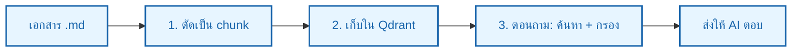

**5 เรื่องเดิม + เรื่องใหม่:**
1. ตัดตามหัวข้อ
2. แยกตาราง
3. ตัดย่อหน้ายาว (overlap)
4. กรอง patient_group ตอนค้นหา
5. Parser fix + เลขหน้า 2 แบบ
6. **ดึงแยกเล่ม + LLM rerank** (13 Jul 2026)

> **Production ใช้ code นี้แล้ว** — `backend/md_chunker.py`, `embed_to_qdrant.py`, `rag_engine.py`  
> รัน `python pipeline.py --reset` → **132 chunks** (AAFP 38 + URI 94)  
> Retrieve: **filter → per-source → LLM rerank (fallback BM25) → top_k**

---

## เรื่องที่ 1: ตัดตามหัวข้อ (ไม่ปนหัวข้อ)

### ปัญหาของวิธีเดิม

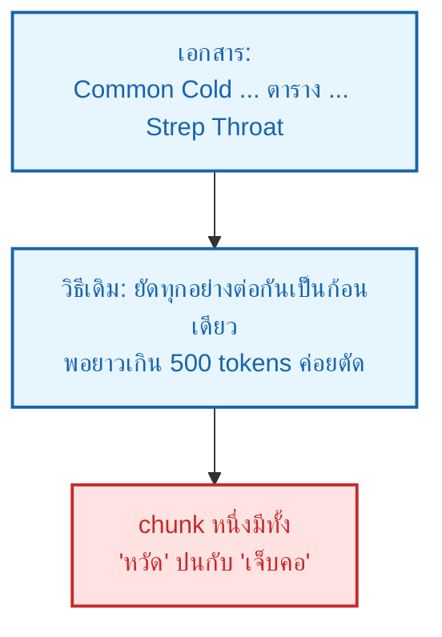

### วิธีใหม่: พอเจอหัวข้อใหม่ ตัด chunk ทันที

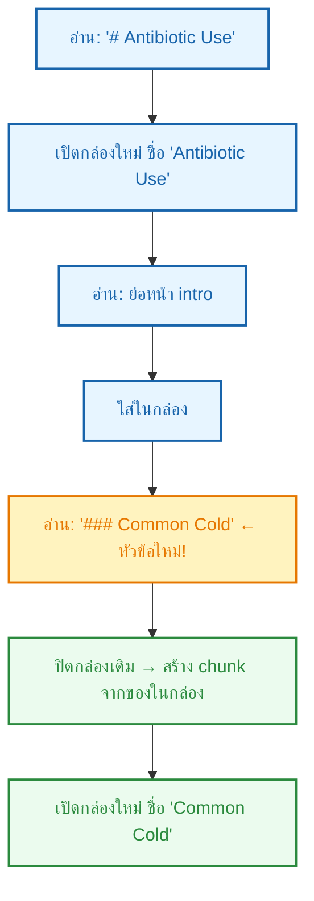

**ผลลัพธ์:**

| chunk | heading | เนื้อหา |
|---|---|---|
| AAFP_0000 | Antibiotic Use | เฉพาะ intro (ไม่ปน Common Cold) |
| AAFP_0002 | Antibiotic Use > Common Cold | เฉพาะย่อหน้าเรื่องหวัด |

---

## เรื่องที่ 2: ตารางแยกเป็น chunk ของตัวเองเสมอ

### เทียบเดิม vs ใหม่

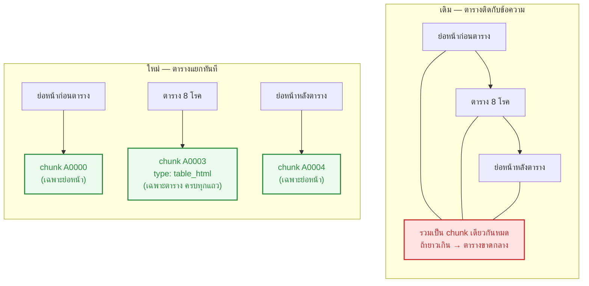

**ทำไมสำคัญ:** ถ้าเภสัชกรถาม "ตารางมีโรคอะไรบ้าง" → ระบบดึง `chunk A0003` มาตรงๆ ได้ครบทุกแถว

---

## เรื่องที่ 3: ย่อหน้ายาวเกิน ตัดยังไงไม่ให้ประโยคขาด

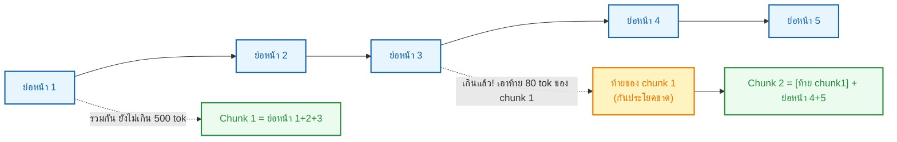

**สรุปสั้น:** ตัดที่ขอบย่อหน้าเท่านั้น + overlap **80 tokens** ระหว่าง chunk

---

## เรื่องที่ 4: ตอนถาม ระบบกรองยังไง (ป้าย patient_group)

### Step by step ของคำถามเคสเด็ก

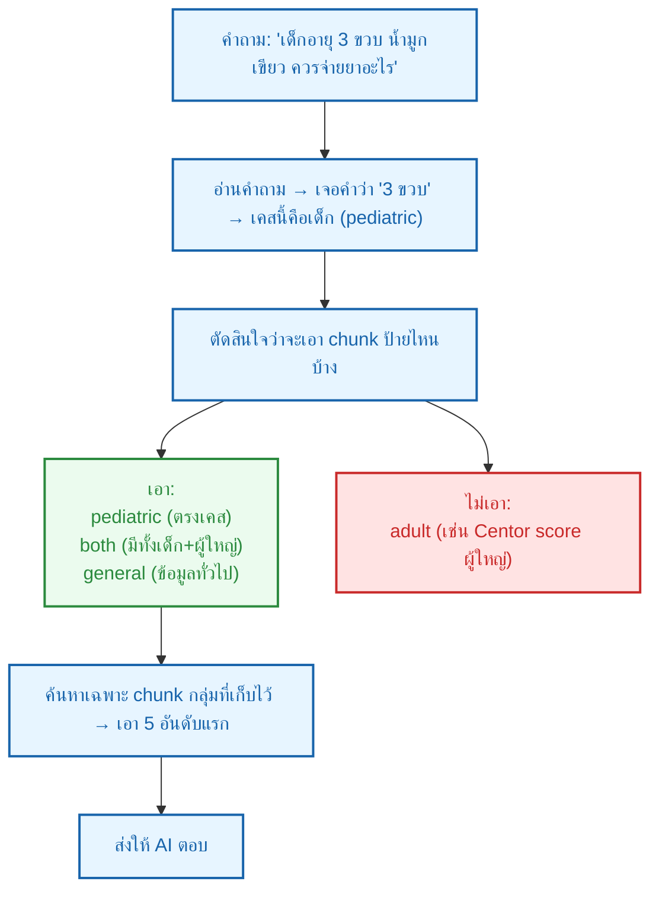

**ทำไมไม่กรองเอาแค่ `pediatric` อย่างเดียว?**  
PDF ไม่ได้แยก section เด็ก/ผู้ใหญ่ชัดเจน — ใช้แบบ **inclusive**: เอาที่ตรงเคส + ทั่วไป + both แต่ตัดกลุ่มตรงข้ามออก

**Production (อัปเดต 13 Jul):** หลัง filter แล้ว ยังมี **ดึงแยกเล่ม + rerank** — ดูเรื่องที่ 6

---

## เรื่องที่ 5: Parser fix + เลขหน้า 2 แบบ (ใหม่ Jul 2026)

### ปัญหาที่พบ — ไม่ใช่ OCR

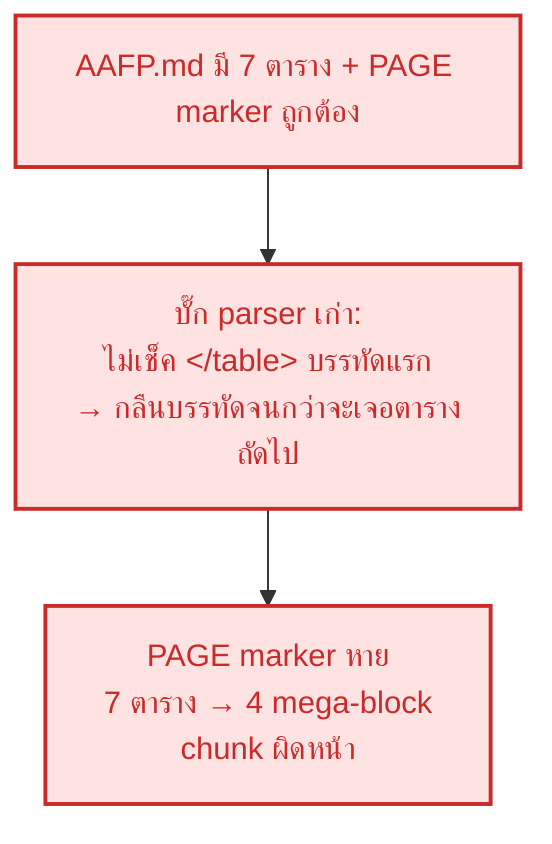

### แก้ยังไง (อยู่ใน production แล้ว)

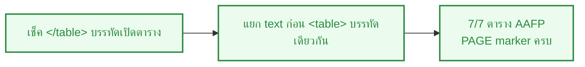

### เลขหน้า 2 แบบ — อย่าสับสน

| field | ความหมาย | ใช้ที่ไหน | ตัวอย่าง |
|---|---|---|---|
| `page` | เลขหน้า PDF (จาก `<!-- PAGE N -->`) | เว็บ `#page=N`, [Ref] ปัจจุบัน | PDF หน้า 2 |
| `journal_page` | เลขหน้าวารสาร (American Family Physician) | eval test case P.628–636 | 628, 629, 632 |

**ทำไม Run 1 Page Recall ได้แค่ 12%?**  
วัดผิด — เทียบ `page` (PDF) กับ `expected_pages` (เลขวารสาร)  
Run 2 ใช้ `Page Recall@5 (journal)` เป็น metric หลัก

**Map ตัวอย่าง AAFP:**

| PDF `page` | `journal_page` |
|---|---|
| 1 | 628 |
| 2 | 629 |
| 4 | 631 |
| 5 | 632 |
| 6 | 633 |
| 8 | 635 |

---

## เรื่องที่ 6: ดึงแยกเล่ม + LLM rerank (13 Jul 2026)

### ปัญหา — คาด AAFP แต่ได้ URI ทั้งก้อน

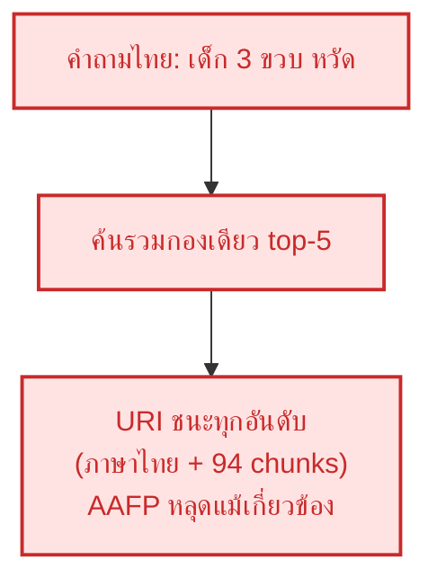

### วิธีใหม่ใน production (`rag_engine.search_chunks`)

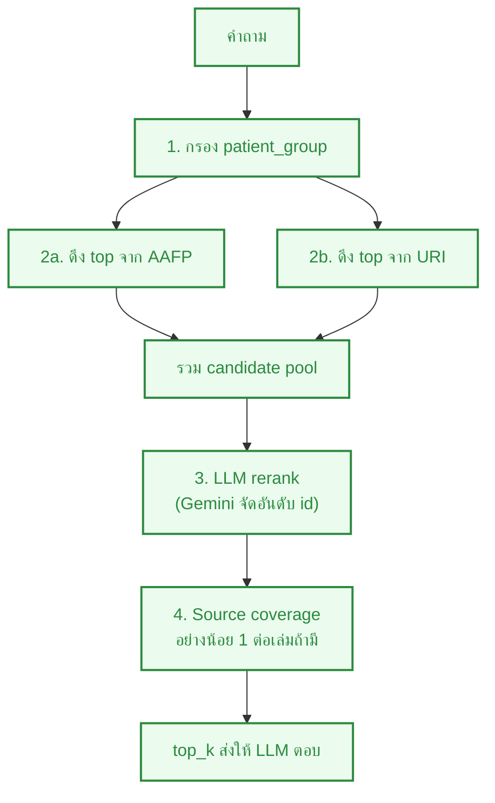

**ทำไมใช้ LLM แทน BM25 เป็น default?**  
BM25 บน pool เล็กๆ ไม่ได้นาน — แต่ LLM เข้าใจบริบทโรค/กลุ่มผู้ป่วยดีกว่า (เช่น AAFP Choosing Wisely vs URI หวัดทั่วไป)  
ถ้า LLM ล้มเหลว/quota → **fallback BM25 อัตโนมัติ**

| ค่า | ความหมาย |
|---|---|
| `RERANK_MODE=llm` | default — Gemini จัดอันดับ |
| `RERANK_MODE=bm25` | hybrid vector+BM25 (ไม่เรียก LLM เพิ่ม) |
| `RERANK_MODE=vector` | เรียงตาม cosine อย่างเดียว |
| `CANDIDATE_MIN_SCORE=0.55` | เกณฑ์ตอนดึงต่อเล่ม |
| `PER_SOURCE_TOP_K=8` | ดึงสูงสุด 8 ต่อเล่มก่อนรวม (~16 candidates ก่อน rerank) |

**ตัวอย่างหลังแก้:**
- เด็กหวัด → top-5 มี **URI + AAFP** (ไม่ใช่ URI ล้วน)
- ผู้ใหญ่ไซนัส → **AAFP** (URI ถูก filter pediatric ตัดออกอยู่แล้ว)

---

## สรุปตัวเลข (experiment — **25 cases** AAFP+URI)

| | Run 1 | Run 2 (vector+filter) | **Run 3 (per-source + LLM)** |
|---|---|---|---|
| Source Recall@5 | 84% | 80% | **100%** |
| MRR | 0.55 | 0.63 | **0.70** |
| Page Recall (journal) | — | 56% | **64%** |
| Page Recall (pdf) | 12% | 12% | 12% |
| Group Accuracy | 100% | 100% | **100%** |
| Chunks | 72 | 132 | 132 |

**ชุดทดสอบ:** `test_case.csv` มี **57** แถว — eval ใช้ **25** (AAFP 22 + URI 3)

**สิ่งที่ยังต้องแก้ต่อ:**
- Frontend ยังแสดง `page` (PDF) ไม่ใช่ `journal_page` ใน [Ref]
- Dose supportive layer ยังไม่ merge
- Safety gate เด็ก <4 ปี ยังไม่มี
- ยังไม่วัดคุณภาพคำตอบ LLM end-to-end

---

## เทียบให้เห็นภาพเดียวจบ

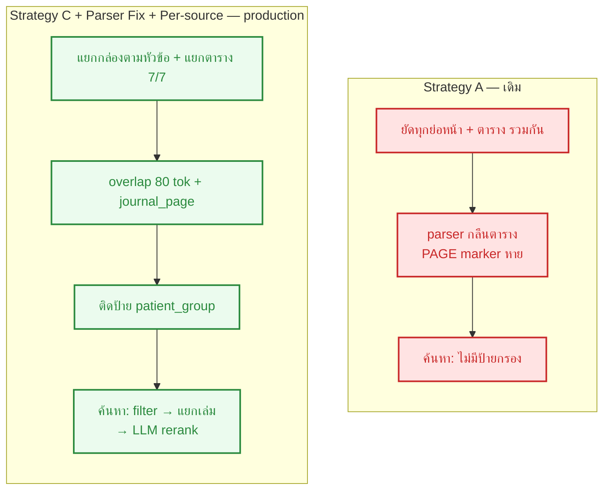

---

## ไฟล์ที่เกี่ยวข้อง

| ไฟล์ | ทำอะไร |
|---|---|
| `backend/md_chunker.py` | Strategy C + parser fix + journal_page |
| `backend/embed_to_qdrant.py` | embed + เก็บ payload |
| `backend/rag_engine.py` | filter + per-source + LLM rerank (fallback BM25) |
| `pipeline.py` | CLI chunk + embed (`--reset`) |
| `data/chunks.jsonl` | 132 chunks ปัจจุบัน |
| `experiments/chunking/` | notebook วัดผล A/B/C |
