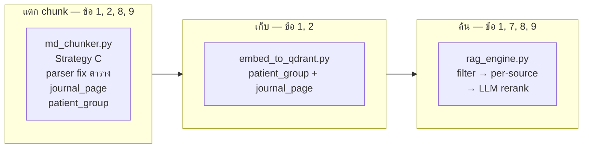

# ปัญหา ณ ตอนนี้ — สถานะหลัง Run 3 (production retrieve)

> อัปเดต: 13 Jul 2026  
> **Eval:** 25 cases จาก `test_case.csv` (กรอง AAFP+URI; ไฟล์รวม 57 cases)  
> **Production retrieve:** filter → ดึงแยกเล่ม (`PER_SOURCE_TOP_K=8`) → LLM rerank → source coverage → top_k

---

## สรุปภาพรวม

เดิมระบุปัญหา **9 ข้อ** — แบ่งตามสถานะหลังแก้ใน production:

| สถานะ | จำนวน | ข้อ |
|---|---|---|
| **แก้ใน production แล้ว** (retrieve/chunk ดีขึ้น แต่ยังไม่ 100%) | **6** | 1, 2, 5, 7, 8, 9 |
| **ยังไม่แก้** (LLM / prompt) | **2** | 3, 4 |
| **อนาคต** (ยังไม่เริ่ม) | **1** | 6 |

**ประเมินรวม: แก้ได้ ~55–65%** ที่ชั้น retrieve (Run 3: Source Recall **1.00**, MRR **0.695**) — ยังไม่วัดคำตอบจริงกับเภสัชกร

### ชุดทดสอบ

| รายการ | จำนวน |
|---|---|
| `data/test_case.csv` ทั้งไฟล์ | **57** |
| ใช้ใน experiment eval | **25** (AAFP 22 + URI 3) |
| มีเลขหน้าใน Ref | **20 / 25** |

### สิ่งที่ merge เข้า production แล้ว

| รายการ | ไฟล์ | ผลลัพธ์ |
|---|---|---|
| Strategy C chunking | `backend/md_chunker.py` | section buffer, overlap 80, table isolation, prefix |
| patient_group tag + filter | `patient_group.py`, `rag_engine.py` | inclusive filter ตอน retrieve |
| **Parser fix ตาราง** | `md_chunker.py` → `split_into_blocks()` | AAFP 7/7 ตาราง |
| **journal_page** | `md_chunker.py`, `embed_to_qdrant.py` | เลขหน้าวารสารสำหรับ eval |
| Re-index | `pipeline.py --reset` | **229 chunks** (AAFP 38 + URI 94 + Dose 97) |
| **ดึงแยกเล่ม + source coverage** | `rag_engine.py` | `PER_SOURCE_TOP_K=8` (AAFP/URI/Dose) |
| **LLM rerank** | `rag_engine.py` | default `RERANK_MODE=llm` → **`models/gemini-3.1-flash-lite`** (= `CHAT_MODEL`; fallback BM25) |
| **Dose supportive** | `dose_chunker.py` + CSV | `page` = หน้า `Dose supportive.pdf` |

### ตัวเลข experiment — Strategy C

| Metric | Run 1 (72 chunk) | Run 2 (132 + vector+filter) | **Run 3 (+ per-source + LLM)** |
|---|---|---|---|
| Source Recall@5 | 0.84 | 0.80 | **1.00** |
| MRR | 0.553 | 0.630 | **0.695** |
| Page Recall@5 (journal) | — | 0.56 | **0.64** |
| Page Recall@5 (pdf) | 0.12 | 0.12 | 0.12 |
| Group Accuracy | 1.00 | 1.00 | **1.00** |

Run 3 เทียบ A/B/C (retrieve เดียวกัน):

| Strategy | MRR | Source@5 | Page (journal) |
|---|---|---|---|
| **C** | **0.695** | **1.00** | **0.64** |
| B | 0.483 | 1.00 | 0.12 |
| A | 0.413 | 1.00 | 0.48 |

> Source hit: A/B/C = **25/25** (ไม่มีเคสพลาด source ทั้งสาม)

---

## Reference & Guideline

### 1. อ้างอิง Guideline ไม่ตรงกลุ่มผู้ป่วย (ผู้ใหญ่ได้ของเด็ก / กลับกัน)

**ปัญหาเดิม:** ถามเคสผู้ใหญ่ แต่ระบบดึง chunk จาก URI/ส่วนเด็กมาอ้างอิง

| | |
|---|---|
| **สถานะ** | ✅ แก้ใน production แล้ว (บางส่วน) |
| **ดีขึ้น ~** | 20–40% |

**แก้ยังไง (ที่ทำไปแล้ว — อยู่ใน production):**

```
ขั้น A — ตอนแตก chunk (md_chunker.py + patient_group.py)
  อ่านเนื้อหา + heading + source
  → ติดป้าย patient_group ทุก chunk: pediatric | adult | both | general

ขั้น B — ตอน embed (embed_to_qdrant.py)
  เก็บ patient_group ลง Qdrant payload คู่กับ vector

ขั้น C — ตอนถาม (rag_engine.py → search_chunks)
  1. infer_patient_group_from_query("เด็ก 3 ขวบ...") → pediatric
  2. filter_groups_for_query() → อนุญาต [general, both, pediatric]
  3. ดึงแยกเล่ม: top จาก AAFP + top จาก URI (กัน URI ทับทั้งก้อน)
  4. LLM rerank (default) หรือ BM25 fallback + source coverage → top_k
```

**ยังไม่พอเพราะ:** chunk `both`/`general` ยังมีเนื้อหาเด็กปนอยู่ — LLM อาจเลือกอ้างผิดส่วนได้

---

### 2. เลขหน้าและเนื้อหาอ้างอิงไม่ตรง Guideline จริง

**ปัญหาเดิม:** ตอบ `[Ref: AAFP P.628]` แต่เนื้อหาไม่ตรงหน้านั้น — Run 1 Page Recall ได้แค่ 12%

| | |
|---|---|
| **สถานะ** | ✅ แก้ใน production แล้ว (บางส่วน) |
| **ดีขึ้น ~** | 30–50% (retrieve ตรงหน้ามากขึ้น) |

**รากเหตุที่พบ (Jul 2026):**
- OCR ถูกต้อง — ปัญหาอยู่ที่ **parser กลืนตาราง** ทำให้ `<!-- PAGE N -->` หาย และ chunk ผิดหน้า
- Run 1 วัด Page Recall ไม่ fair — เทียบ `page` (PDF) กับเลขวารสารใน test case (P.628–636)

**แก้ยังไง (ที่ทำไปแล้ว — อยู่ใน production):**

```
1. Parser fix (split_into_blocks)
   - เช็ค </table> บรรทัดแรกของตาราง
   - แยก inline text ก่อน <table> บรรทัดเดียวกัน
   → AAFP 7 ตารางครบ, PAGE marker ไม่หาย

2. journal_page (ใหม่)
   - build_journal_page_map() อ่านเลขวารสารจาก .md ก่อน pre_clean
   - resolve_journal_page() map PDF page → journal page
   - เก็บใน chunk + Qdrant payload (eval ใช้ตัวนี้)

3. page ไม่เปลี่ยน
   - ยังเป็น PDF page สำหรับ frontend #page=N
```

**ยังไม่พอ:** frontend ยังแสดง `page` (PDF) ใน [Ref] — ยังไม่แสดง `journal_page`; LLM อาจสรุปผิดแม้ chunk ถูก

**รอบถัดไป:** แสดง journal page ใน UI, regression check กับ `expected_pages`

---

### 3. Reference ภายนอกไม่ระบุ URL / แหล่งที่มาชัดเจน

| | |
|---|---|
| **สถานะ** | ❌ ยังไม่แก้ |
| **ดีขึ้น ~** | 0% |

**จะแก้ยังไง:** แก้ `SYSTEM_PROMPT` ใน `rag_engine.py` บังคับ format Ref

---

### 4. คำตอบผสม Guideline + ความรู้ทั่วไป ไม่แยกให้ชัด

| | |
|---|---|
| **สถานะ** | ❌ ยังไม่แก้ |
| **ดีขึ้น ~** | 0% |

**จะแก้ยังไง:** แยก section ในคำตอบ + ห้ามใส่ [Ref] ถ้า chunk ไม่อยู่ใน context

---

## Clinical Accuracy

### 5. Dose เด็กแสดงแค่ Maximum ไม่มี Min–Max

| | |
|---|---|
| **สถานะ** | ✅ merge Dose เข้า production แล้ว (ยังไม่มี mL calc) |
| **ดีขึ้น ~** | ชั้น retrieve พร้อม — คุณภาพคำตอบยังไม่วัด |

**ที่ทำแล้ว:** `dose_chunker.py` + pipeline → 97 chunks; `page` = หน้า `Dose supportive.pdf`; ดึงแยกเล่มคู่ AAFP/URI; LLM rerank จัดอันดับ

**ยังไม่ได้:** บังคับแสดง Min–Max ในคำตอบ, mL calculator, วางไฟล์ PDF ใน `data/`

---

### 6. คำนวณ mL จากความแรงยาน้ำ (Amoxicillin ฯลฯ)

| | |
|---|---|
| **สถานะ** | 🔮 อนาคต |
| **ดีขึ้น ~** | 0% |

---

### 7. ระยะเวลารักษาไม่ครบ (เช่น AOM) — ไม่เปรียบเทียบ URI + AAFP

| | |
|---|---|
| **สถานะ** | ✅ แก้บางส่วน — **ดึงสองเล่มแล้ว** (ยังไม่บังคับ LLM เปรียบเทียบ) |
| **ดีขึ้น ~** | 30–40% (Run 3 Source 1.00 ช่วยทางอ้อม) |

**ที่ทำแล้ว (13 Jul — production):**
- `search_chunks()` ดึงแยก AAFP + URI แล้วรวม (source coverage)
- hybrid / LLM rerank คัดอันดับใน pool ร่วม
- เคสเด็กหวัด: top-5 มีทั้ง URI และ AAFP (ไม่ใช่ URI ล้วน)

**ยังไม่ได้:** prompt บังคับสรุปเปรียบเทียบ `แนวทางไทย (URI)` vs `AAFP` ในคำตอบเดียว

---

### 8. ดึง Guideline ผิดหัวข้อ / ผิดเล่ม (เช่น คาด AAFP ได้ URI)

| | |
|---|---|
| **สถานะ** | ✅ แก้ใน production แล้ว — **ดีที่สุดในรอบนี้** |
| **ดีขึ้น ~** | 60–70% (retrieve) — Run 3 Source **1.00**, MRR **0.695** |

**ที่ทำแล้ว:**
- Strategy C: section buffer, table isolation, prefix, patient_group → MRR 0.41→0.63
- **13 Jul:** ดึงแยกเล่ม + **LLM rerank** (fallback BM25) + source coverage  
  → แก้ปัญหา URI (ไทย, 94 chunks) ทับ AAFP (อังกฤษ, 38 chunks)

**ยังไม่พอ:** LLM ยังสรุปผิดได้แม้ context มีถูกเล่ม; rerank เพิ่ม 1 API call ต่อคำถาม

---

### 9. เด็ก <4 ปี แนะนำยาแก้ไอไม่ตรง Guideline

| | |
|---|---|
| **สถานะ** | ✅ แก้บางส่วน (retrieve) |
| **ดีขึ้น ~** | 30–40% |

**ที่ทำแล้ว:** ตาราง BEST PRACTICES แยกเป็น `table_html` chunk → filter pediatric ดึงได้ง่ายขึ้น + AAFP ไม่ถูก URI กลบทั้งหมด

**ยังไม่ได้:** safety gate บังคับก่อนส่งคำตอบ

---

## สรุป: แก้อะไรไปแล้วบ้าง (ไฟล์ + flow)



| ข้อปัญหา | สถานะ | ไฟล์หลัก |
|---|---|---|
| 1 กลุ่มผู้ป่วยผิด | ✅ production | `patient_group.py`, `rag_engine.py` |
| 2 เลขหน้าผิด | ✅ production (parser + journal_page) | `md_chunker.py`, `embed_to_qdrant.py` |
| 3 URL | ❌ | — |
| 4 ผสมความรู้ทั่วไป | ❌ | — |
| 5 Dose Min–Max | ✅ Dose ใน RAG แล้ว (ยังไม่มี mL) | `dose_chunker.py` |
| 6 mL | 🔮 | — |
| 7 ระยะเวลารักษา / สองเล่ม | ✅ ดึงสองเล่มแล้ว | `rag_engine.py` |
| 8 ผิดหัวข้อ / ผิดเล่ม | ✅ production | `md_chunker.py`, `rag_engine.py` |
| 9 ยาแก้ไอเด็ก | ✅ บางส่วน | `md_chunker.py`, `rag_engine.py` |

---

## Roadmap ถัดไป

1. **วาง `data/Dose supportive.pdf`** ให้เปิด `#page=N` จาก UI ได้ (CSV/chunk พร้อมแล้ว)
2. **Frontend แสดง journal_page ใน [Ref]** → ข้อ 2 (ส่วน UI)
3. **Prompt / Ref format + บังคับเทียบ URI↔AAFP** → ข้อ 3, 4, 7
4. **Safety gate <4 ปี** → ข้อ 9
5. **mL calculator** → ข้อ 6
6. **วัดคุณภาพคำตอบจริง** (ไม่ใช่แค่ retrieve 25 cases)

---

## หมายเหตุ

- Eval retrieve = **25 cases** (จาก CSV 57 แถว — กรองเฉพาะ AAFP/URI)
- Production = **filter + per-source (AAFP/URI/Dose) + LLM rerank**
  - Rerank model: **`models/gemini-3.1-flash-lite`** (`CHAT_MODEL`) เมื่อ `RERANK_MODE=llm`
  - Dose: คอลัมน์ `Page` ใน CSV = หน้า PDF `Dose supportive.pdf`
- รายละเอียด: `README.md` (สรุปแผน+ผล), `STRATEGY_C_explained.md`, `CHANGELOG.md`
